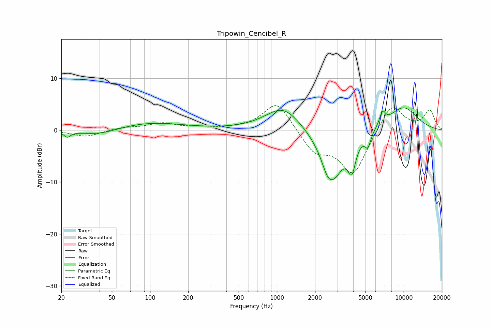

# Tripowin_Cencibel_R
See [usage instructions](https://github.com/jaakkopasanen/AutoEq#usage) for more options and info.

### Parametric EQs
Apply preamp of -4.4 dB when using parametric equalizer.

|   # | Type    |   Fc (Hz) |    Q |   Gain (dB) |
|-----|---------|-----------|------|-------------|
|   1 | Peaking |        22 | 5.71 |        -1.1 |
|   2 | Peaking |        40 | 0.91 |        -1.3 |
|   3 | Peaking |        97 | 0.51 |         1.5 |
|   4 | Peaking |      1122 | 1.01 |         4.7 |
|   5 | Peaking |      2486 | 3.65 |        -1.5 |
|   6 | Peaking |      2755 | 1.55 |        -9.3 |
|   7 | Peaking |      3895 | 4.6  |        -5.3 |
|   8 | Peaking |      5220 | 6    |        -2.6 |
|   9 | Peaking |      6804 | 5.96 |         2.5 |
|  10 | Peaking |      9883 | 1.01 |         4.5 |

### Fixed Band EQs
When using fixed band (also called graphic) equalizer, apply preamp of **-4.8 dB** (if available) and set gains manually with these parameters.

|   # | Type    |   Fc (Hz) |    Q |   Gain (dB) |
|-----|---------|-----------|------|-------------|
|   1 | Peaking |        31 | 1.41 |        -1.3 |
|   2 | Peaking |        62 | 1.41 |         0.5 |
|   3 | Peaking |       125 | 1.41 |         1.3 |
|   4 | Peaking |       250 | 1.41 |         0.4 |
|   5 | Peaking |       500 | 1.41 |         0.2 |
|   6 | Peaking |      1000 | 1.41 |         5.7 |
|   7 | Peaking |      2000 | 1.41 |        -4   |
|   8 | Peaking |      4000 | 1.41 |        -8.5 |
|   9 | Peaking |      8000 | 1.41 |         5.5 |
|  10 | Peaking |     16000 | 1.41 |         3.7 |

### Graphs

