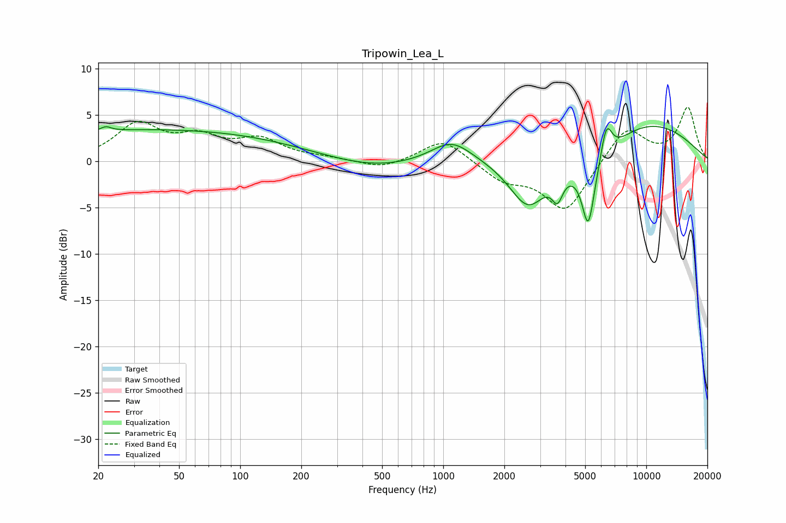

# Tripowin_Lea_L
See [usage instructions](https://github.com/jaakkopasanen/AutoEq#usage) for more options and info.

### Parametric EQs
Apply preamp of -3.9 dB when using parametric equalizer.

|   # | Type    |   Fc (Hz) |    Q |   Gain (dB) |
|-----|---------|-----------|------|-------------|
|   1 | Peaking |        22 | 5.68 |         0.5 |
|   2 | Peaking |        38 | 0.18 |         3.4 |
|   3 | Peaking |       444 | 0.64 |        -1   |
|   4 | Peaking |      1098 | 1.4  |         2.4 |
|   5 | Peaking |      2626 | 1.46 |        -5.8 |
|   6 | Peaking |      3655 | 5.13 |        -2.6 |
|   7 | Peaking |      5176 | 4.66 |        -6.3 |
|   8 | Peaking |      5638 | 1.19 |        -4   |
|   9 | Peaking |      6353 | 4.63 |         4.2 |
|  10 | Peaking |      8491 | 0.38 |         4.9 |

### Fixed Band EQs
When using fixed band (also called graphic) equalizer, apply preamp of **-5.9 dB** (if available) and set gains manually with these parameters.

|   # | Type    |   Fc (Hz) |    Q |   Gain (dB) |
|-----|---------|-----------|------|-------------|
|   1 | Peaking |        31 | 1.41 |         3.8 |
|   2 | Peaking |        62 | 1.41 |         2.2 |
|   3 | Peaking |       125 | 1.41 |         2.1 |
|   4 | Peaking |       250 | 1.41 |         0.3 |
|   5 | Peaking |       500 | 1.41 |        -0.9 |
|   6 | Peaking |      1000 | 1.41 |         2.5 |
|   7 | Peaking |      2000 | 1.41 |        -1.9 |
|   8 | Peaking |      4000 | 1.41 |        -5.4 |
|   9 | Peaking |      8000 | 1.41 |         3.8 |
|  10 | Peaking |     16000 | 1.41 |         5.7 |

### Graphs

