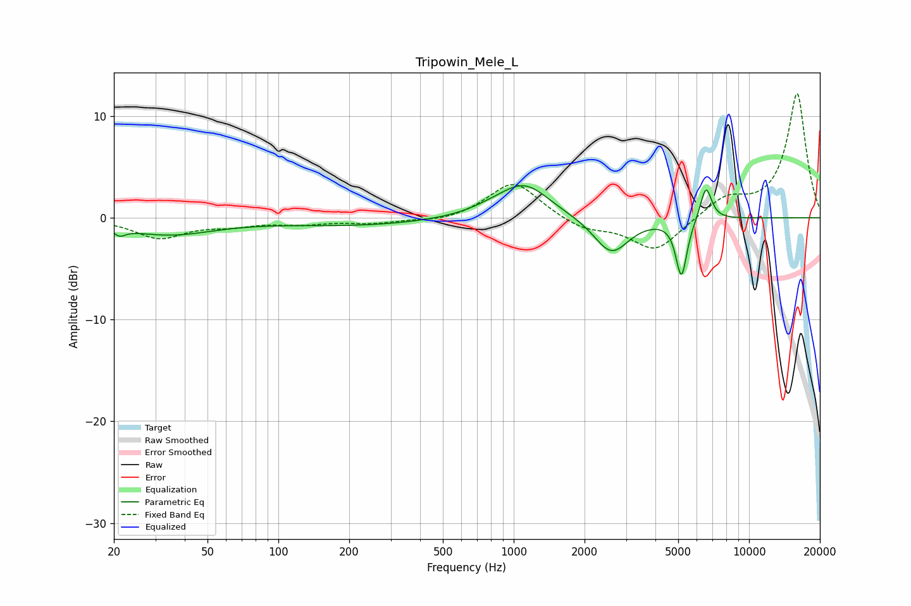

# Tripowin_Mele_L
See [usage instructions](https://github.com/jaakkopasanen/AutoEq#usage) for more options and info.

### Parametric EQs
Apply preamp of -3.2 dB when using parametric equalizer.

|   # | Type    |   Fc (Hz) |    Q |   Gain (dB) |
|-----|---------|-----------|------|-------------|
|   1 | Peaking |        21 | 6    |         1   |
|   2 | Peaking |        21 | 5.69 |        -1.7 |
|   3 | Peaking |        34 | 0.72 |        -1.6 |
|   4 | Peaking |       222 | 0.43 |        -0.7 |
|   5 | Peaking |       838 | 1.25 |         0.6 |
|   6 | Peaking |      1118 | 1.33 |         3.1 |
|   7 | Peaking |      2600 | 1.91 |        -3.6 |
|   8 | Peaking |      5088 | 6    |        -0.8 |
|   9 | Peaking |      5173 | 6    |        -4.8 |
|  10 | Peaking |      6559 | 5.72 |         3.4 |

### Fixed Band EQs
When using fixed band (also called graphic) equalizer, apply preamp of **-12.3 dB** (if available) and set gains manually with these parameters.

|   # | Type    |   Fc (Hz) |    Q |   Gain (dB) |
|-----|---------|-----------|------|-------------|
|   1 | Peaking |        31 | 1.41 |        -1.9 |
|   2 | Peaking |        62 | 1.41 |        -0.6 |
|   3 | Peaking |       125 | 1.41 |        -0.5 |
|   4 | Peaking |       250 | 1.41 |        -0.5 |
|   5 | Peaking |       500 | 1.41 |        -0.4 |
|   6 | Peaking |      1000 | 1.41 |         3.6 |
|   7 | Peaking |      2000 | 1.41 |        -1.1 |
|   8 | Peaking |      4000 | 1.41 |        -3.3 |
|   9 | Peaking |      8000 | 1.41 |         1.9 |
|  10 | Peaking |     16000 | 1.41 |        12.2 |

### Graphs

