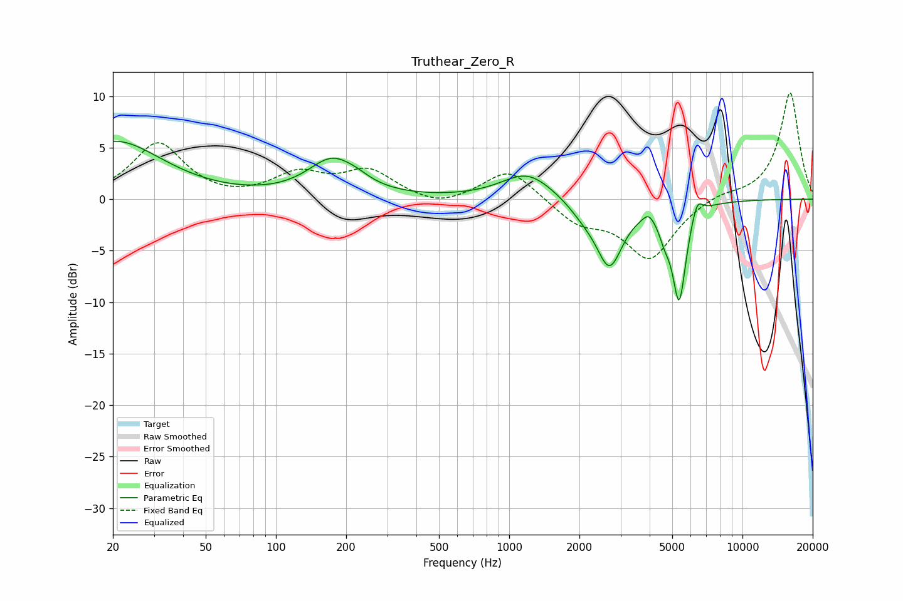

# Truthear_Zero_R
See [usage instructions](https://github.com/jaakkopasanen/AutoEq#usage) for more options and info.

### Parametric EQs
Apply preamp of -5.7 dB when using parametric equalizer.

|   # | Type    |   Fc (Hz) |    Q |   Gain (dB) |
|-----|---------|-----------|------|-------------|
|   1 | Peaking |        20 | 0.7  |         5.6 |
|   2 | Peaking |       175 | 1.34 |         3.7 |
|   3 | Peaking |       225 | 2.76 |         0.3 |
|   4 | Peaking |      1198 | 1.27 |         2.6 |
|   5 | Peaking |      2080 | 2.14 |        -1   |
|   6 | Peaking |      2690 | 2.45 |        -6.2 |
|   7 | Peaking |      3956 | 6    |         0.8 |
|   8 | Peaking |      4634 | 5.96 |        -1.5 |
|   9 | Peaking |      5353 | 4.67 |        -9.5 |
|  10 | Peaking |      6386 | 5.84 |         1.8 |

### Fixed Band EQs
When using fixed band (also called graphic) equalizer, apply preamp of **-10.4 dB** (if available) and set gains manually with these parameters.

|   # | Type    |   Fc (Hz) |    Q |   Gain (dB) |
|-----|---------|-----------|------|-------------|
|   1 | Peaking |        31 | 1.41 |         5.4 |
|   2 | Peaking |        62 | 1.41 |        -0.2 |
|   3 | Peaking |       125 | 1.41 |         2.3 |
|   4 | Peaking |       250 | 1.41 |         2.6 |
|   5 | Peaking |       500 | 1.41 |        -0.9 |
|   6 | Peaking |      1000 | 1.41 |         3.1 |
|   7 | Peaking |      2000 | 1.41 |        -2.1 |
|   8 | Peaking |      4000 | 1.41 |        -5.7 |
|   9 | Peaking |      8000 | 1.41 |         0.6 |
|  10 | Peaking |     16000 | 1.41 |        10.4 |

### Graphs

