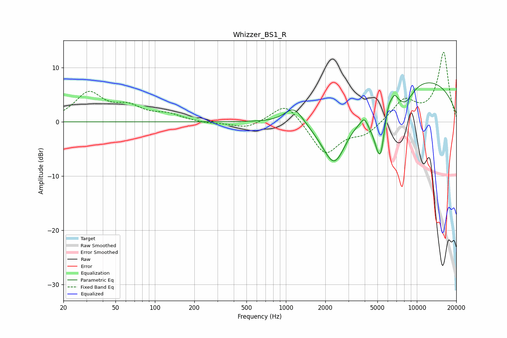

# Whizzer_BS1_R
See [usage instructions](https://github.com/jaakkopasanen/AutoEq#usage) for more options and info.

### Parametric EQs
Apply preamp of -7.3 dB when using parametric equalizer.

|   # | Type    |   Fc (Hz) |    Q |   Gain (dB) |
|-----|---------|-----------|------|-------------|
|   1 | Peaking |      1156 | 1.99 |         3.2 |
|   2 | Peaking |      2346 | 1.36 |       -10.1 |
|   3 | Peaking |      3964 | 5.99 |         1.2 |
|   4 | Peaking |      4766 | 2.23 |        -2.5 |
|   5 | Peaking |      5179 | 3.37 |        -6.4 |
|   6 | Peaking |      5344 | 5.65 |        -2.7 |
|   7 | Peaking |      6051 | 5.42 |         1.7 |
|   8 | Peaking |      6739 | 5.63 |         1.5 |
|   9 | Peaking |      8168 | 1.99 |        -3.3 |
|  10 | Peaking |     10000 | 0.27 |         8.2 |

### Fixed Band EQs
When using fixed band (also called graphic) equalizer, apply preamp of **-12.9 dB** (if available) and set gains manually with these parameters.

|   # | Type    |   Fc (Hz) |    Q |   Gain (dB) |
|-----|---------|-----------|------|-------------|
|   1 | Peaking |        31 | 1.41 |         5.1 |
|   2 | Peaking |        62 | 1.41 |         2.4 |
|   3 | Peaking |       125 | 1.41 |         1.2 |
|   4 | Peaking |       250 | 1.41 |        -0.3 |
|   5 | Peaking |       500 | 1.41 |        -1.3 |
|   6 | Peaking |      1000 | 1.41 |         3.8 |
|   7 | Peaking |      2000 | 1.41 |        -6.1 |
|   8 | Peaking |      4000 | 1.41 |        -2.1 |
|   9 | Peaking |      8000 | 1.41 |         3.9 |
|  10 | Peaking |     16000 | 1.41 |        12.8 |

### Graphs

