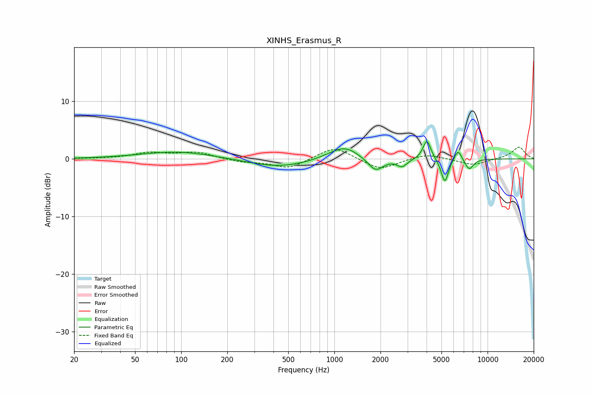

# XINHS_Erasmus_R
See [usage instructions](https://github.com/jaakkopasanen/AutoEq#usage) for more options and info.

### Parametric EQs
Apply preamp of -3.1 dB when using parametric equalizer.

|   # | Type    |   Fc (Hz) |    Q |   Gain (dB) |
|-----|---------|-----------|------|-------------|
|   1 | Peaking |        95 | 0.6  |         1.3 |
|   2 | Peaking |       430 | 0.72 |        -1.5 |
|   3 | Peaking |       957 | 1.51 |         0.6 |
|   4 | Peaking |      1187 | 1.67 |         2   |
|   5 | Peaking |      1860 | 2.9  |        -2.3 |
|   6 | Peaking |      2766 | 4.38 |        -1.3 |
|   7 | Peaking |      4018 | 5.55 |         3.5 |
|   8 | Peaking |      5257 | 5.91 |        -4.2 |
|   9 | Peaking |      6411 | 5.99 |         2   |
|  10 | Peaking |      7595 | 4.95 |        -1.9 |

### Fixed Band EQs
When using fixed band (also called graphic) equalizer, apply preamp of **-2.1 dB** (if available) and set gains manually with these parameters.

|   # | Type    |   Fc (Hz) |    Q |   Gain (dB) |
|-----|---------|-----------|------|-------------|
|   1 | Peaking |        31 | 1.41 |         0   |
|   2 | Peaking |        62 | 1.41 |         1   |
|   3 | Peaking |       125 | 1.41 |         1.1 |
|   4 | Peaking |       250 | 1.41 |        -0.5 |
|   5 | Peaking |       500 | 1.41 |        -1.7 |
|   6 | Peaking |      1000 | 1.41 |         2.2 |
|   7 | Peaking |      2000 | 1.41 |        -2   |
|   8 | Peaking |      4000 | 1.41 |         0.9 |
|   9 | Peaking |      8000 | 1.41 |        -1.1 |
|  10 | Peaking |     16000 | 1.41 |         2.1 |

### Graphs

