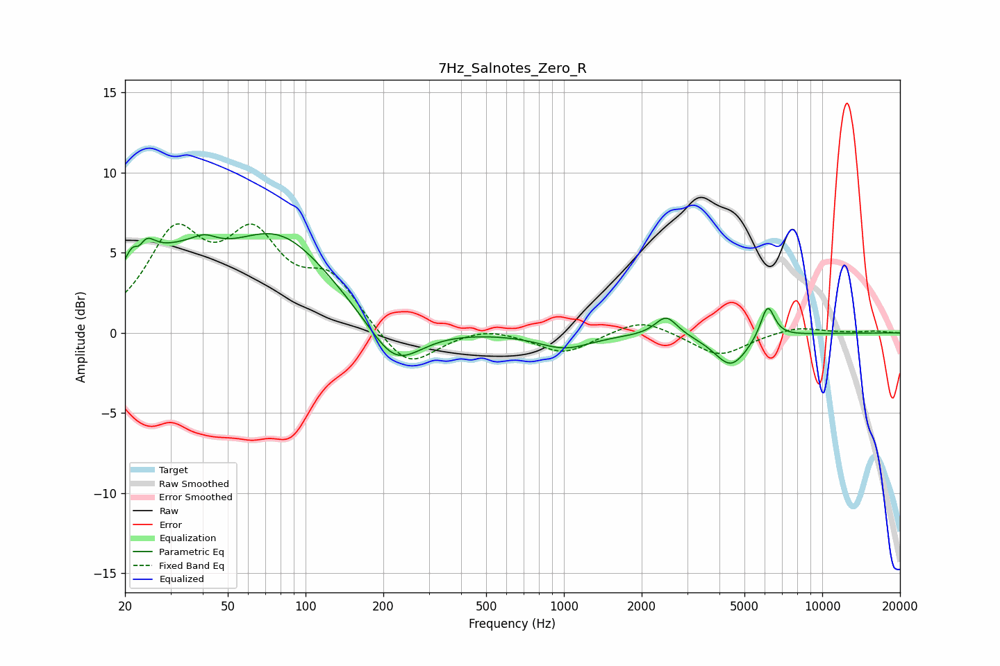

# 7Hz_Salnotes_Zero_R
See [usage instructions](https://github.com/jaakkopasanen/AutoEq#usage) for more options and info.

### Parametric EQs
Apply preamp of -6.3 dB when using parametric equalizer.

|   # | Type    |   Fc (Hz) |    Q |   Gain (dB) |
|-----|---------|-----------|------|-------------|
|   1 | Peaking |        23 | 3.23 |         4.4 |
|   2 | Peaking |        23 | 5.98 |        -2.1 |
|   3 | Peaking |        32 | 0.94 |         3   |
|   4 | Peaking |        41 | 3.01 |         0.6 |
|   5 | Peaking |        79 | 0.68 |         5.6 |
|   6 | Peaking |       221 | 1.37 |        -2.9 |
|   7 | Peaking |      1009 | 1.36 |        -0.9 |
|   8 | Peaking |      2490 | 3.32 |         1.2 |
|   9 | Peaking |      4435 | 2.12 |        -2.1 |
|  10 | Peaking |      6144 | 4.99 |         2.1 |

### Fixed Band EQs
When using fixed band (also called graphic) equalizer, apply preamp of **-6.9 dB** (if available) and set gains manually with these parameters.

|   # | Type    |   Fc (Hz) |    Q |   Gain (dB) |
|-----|---------|-----------|------|-------------|
|   1 | Peaking |        31 | 1.41 |         5.7 |
|   2 | Peaking |        62 | 1.41 |         5.2 |
|   3 | Peaking |       125 | 1.41 |         3.1 |
|   4 | Peaking |       250 | 1.41 |        -2.4 |
|   5 | Peaking |       500 | 1.41 |         0.4 |
|   6 | Peaking |      1000 | 1.41 |        -1.3 |
|   7 | Peaking |      2000 | 1.41 |         1   |
|   8 | Peaking |      4000 | 1.41 |        -1.5 |
|   9 | Peaking |      8000 | 1.41 |         0.4 |
|  10 | Peaking |     16000 | 1.41 |         0.1 |

### Graphs

