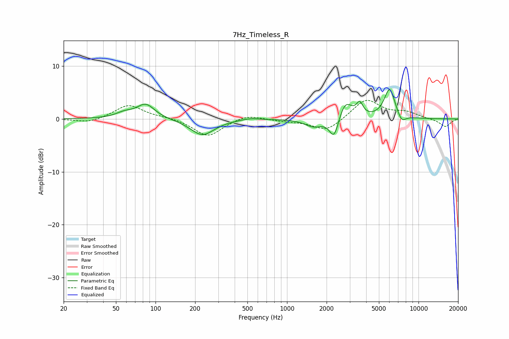

# 7Hz_Timeless_R
See [usage instructions](https://github.com/jaakkopasanen/AutoEq#usage) for more options and info.

### Parametric EQs
Apply preamp of -5.6 dB when using parametric equalizer.

|   # | Type    |   Fc (Hz) |    Q |   Gain (dB) |
|-----|---------|-----------|------|-------------|
|   1 | Peaking |        58 | 2.15 |         0.9 |
|   2 | Peaking |        84 | 2.08 |         2.7 |
|   3 | Peaking |       227 | 1.56 |        -3.1 |
|   4 | Peaking |       527 | 2.15 |         0.4 |
|   5 | Peaking |      1596 | 2.13 |        -1.5 |
|   6 | Peaking |      2280 | 4.05 |        -4   |
|   7 | Peaking |      2776 | 2.84 |         3.5 |
|   8 | Peaking |      3573 | 5.78 |         2.3 |
|   9 | Peaking |      6029 | 3.32 |         5.7 |
|  10 | Peaking |      7435 | 4.25 |        -1.6 |

### Fixed Band EQs
When using fixed band (also called graphic) equalizer, apply preamp of **-3.6 dB** (if available) and set gains manually with these parameters.

|   # | Type    |   Fc (Hz) |    Q |   Gain (dB) |
|-----|---------|-----------|------|-------------|
|   1 | Peaking |        31 | 1.41 |        -0.8 |
|   2 | Peaking |        62 | 1.41 |         2.7 |
|   3 | Peaking |       125 | 1.41 |         0.3 |
|   4 | Peaking |       250 | 1.41 |        -3.3 |
|   5 | Peaking |       500 | 1.41 |         1   |
|   6 | Peaking |      1000 | 1.41 |        -0.4 |
|   7 | Peaking |      2000 | 1.41 |        -2.4 |
|   8 | Peaking |      4000 | 1.41 |         3.8 |
|   9 | Peaking |      8000 | 1.41 |         1.1 |
|  10 | Peaking |     16000 | 1.41 |        -1.5 |

### Graphs

