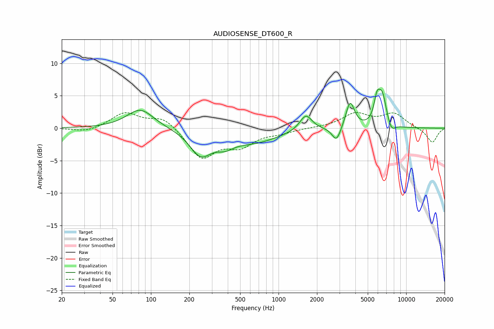

# AUDIOSENSE_DT600_R
See [usage instructions](https://github.com/jaakkopasanen/AutoEq#usage) for more options and info.

### Parametric EQs
Apply preamp of -6.1 dB when using parametric equalizer.

|   # | Type    |   Fc (Hz) |    Q |   Gain (dB) |
|-----|---------|-----------|------|-------------|
|   1 | Peaking |        83 | 1.35 |         3   |
|   2 | Peaking |       245 | 1.69 |        -3.7 |
|   3 | Peaking |       379 | 2.07 |        -1.3 |
|   4 | Peaking |       638 | 0.71 |        -2   |
|   5 | Peaking |      1636 | 2.94 |         2.5 |
|   6 | Peaking |      2847 | 4.11 |        -2.3 |
|   7 | Peaking |      3638 | 4.17 |         4.1 |
|   8 | Peaking |      5908 | 5.77 |         3.3 |
|   9 | Peaking |      6503 | 4.27 |         4.5 |
|  10 | Peaking |      7685 | 4.83 |        -1.3 |

### Fixed Band EQs
When using fixed band (also called graphic) equalizer, apply preamp of **-2.5 dB** (if available) and set gains manually with these parameters.

|   # | Type    |   Fc (Hz) |    Q |   Gain (dB) |
|-----|---------|-----------|------|-------------|
|   1 | Peaking |        31 | 1.41 |        -0.7 |
|   2 | Peaking |        62 | 1.41 |         2.4 |
|   3 | Peaking |       125 | 1.41 |         1.8 |
|   4 | Peaking |       250 | 1.41 |        -4.6 |
|   5 | Peaking |       500 | 1.41 |        -2.4 |
|   6 | Peaking |      1000 | 1.41 |        -0.6 |
|   7 | Peaking |      2000 | 1.41 |         0.1 |
|   8 | Peaking |      4000 | 1.41 |         2.2 |
|   9 | Peaking |      8000 | 1.41 |         2.1 |
|  10 | Peaking |     16000 | 1.41 |        -2.3 |

### Graphs

