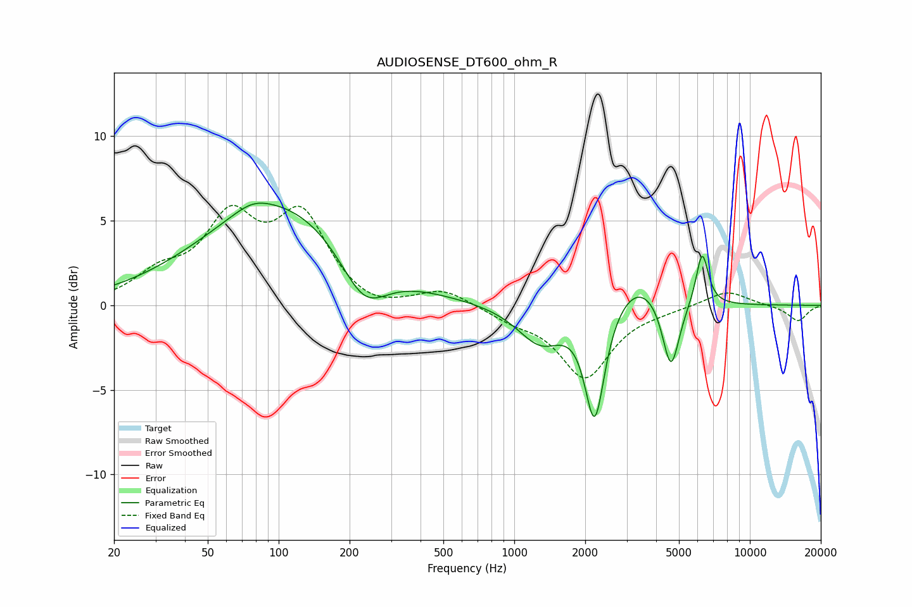

# AUDIOSENSE_DT600_ohm_R
See [usage instructions](https://github.com/jaakkopasanen/AutoEq#usage) for more options and info.

### Parametric EQs
Apply preamp of -6.1 dB when using parametric equalizer.

|   # | Type    |   Fc (Hz) |    Q |   Gain (dB) |
|-----|---------|-----------|------|-------------|
|   1 | Peaking |        27 | 0.81 |         0   |
|   2 | Peaking |        77 | 1.82 |         0.5 |
|   3 | Peaking |       102 | 0.43 |         6   |
|   4 | Peaking |       230 | 1.39 |        -3.1 |
|   5 | Peaking |      1292 | 1.44 |        -2.3 |
|   6 | Peaking |      2190 | 3.46 |        -6   |
|   7 | Peaking |      2245 | 3.42 |        -0.7 |
|   8 | Peaking |      3349 | 1.31 |         1.8 |
|   9 | Peaking |      4623 | 3.89 |        -4.3 |
|  10 | Peaking |      6272 | 5.32 |         3.2 |

### Fixed Band EQs
When using fixed band (also called graphic) equalizer, apply preamp of **-6.0 dB** (if available) and set gains manually with these parameters.

|   # | Type    |   Fc (Hz) |    Q |   Gain (dB) |
|-----|---------|-----------|------|-------------|
|   1 | Peaking |        31 | 1.41 |         1.5 |
|   2 | Peaking |        62 | 1.41 |         4.7 |
|   3 | Peaking |       125 | 1.41 |         5   |
|   4 | Peaking |       250 | 1.41 |        -0.6 |
|   5 | Peaking |       500 | 1.41 |         0.9 |
|   6 | Peaking |      1000 | 1.41 |        -0.7 |
|   7 | Peaking |      2000 | 1.41 |        -4.2 |
|   8 | Peaking |      4000 | 1.41 |        -0.2 |
|   9 | Peaking |      8000 | 1.41 |         0.9 |
|  10 | Peaking |     16000 | 1.41 |        -0.9 |

### Graphs

