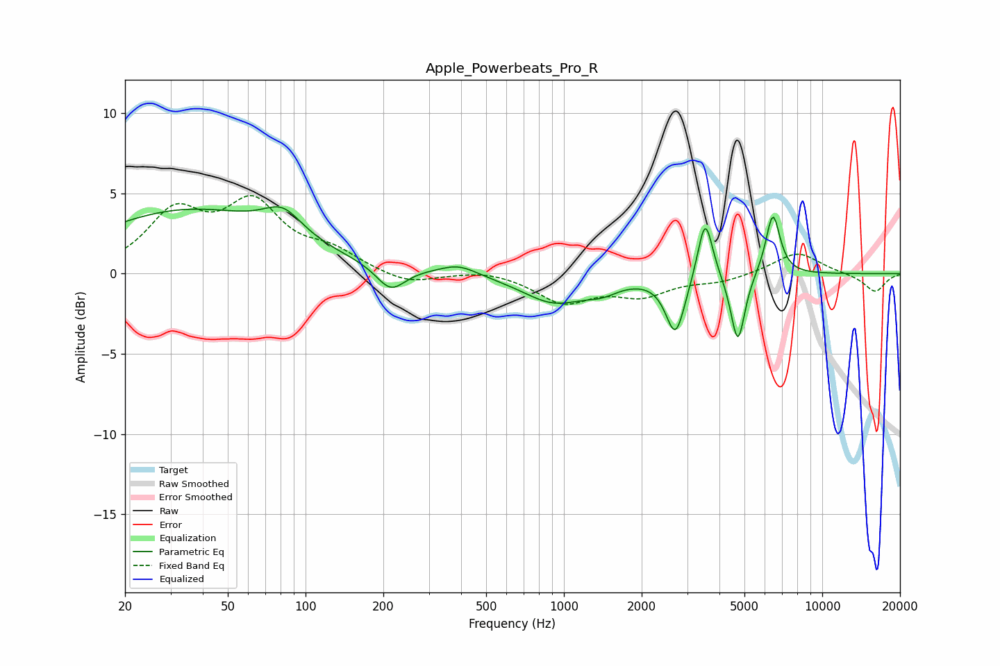

# Apple_Powerbeats_Pro_R
See [usage instructions](https://github.com/jaakkopasanen/AutoEq#usage) for more options and info.

### Parametric EQs
Apply preamp of -4.3 dB when using parametric equalizer.

|   # | Type    |   Fc (Hz) |    Q |   Gain (dB) |
|-----|---------|-----------|------|-------------|
|   1 | Peaking |        35 | 0.39 |         3.9 |
|   2 | Peaking |        82 | 1.89 |         1.6 |
|   3 | Peaking |       213 | 2.52 |        -1.6 |
|   4 | Peaking |       391 | 1.94 |         0.6 |
|   5 | Peaking |       917 | 1.13 |        -1.8 |
|   6 | Peaking |      1408 | 2.21 |        -0.6 |
|   7 | Peaking |      2704 | 3.81 |        -3.7 |
|   8 | Peaking |      3522 | 4.87 |         3.9 |
|   9 | Peaking |      4713 | 5.15 |        -4.4 |
|  10 | Peaking |      6441 | 4.93 |         3.9 |

### Fixed Band EQs
When using fixed band (also called graphic) equalizer, apply preamp of **-5.0 dB** (if available) and set gains manually with these parameters.

|   # | Type    |   Fc (Hz) |    Q |   Gain (dB) |
|-----|---------|-----------|------|-------------|
|   1 | Peaking |        31 | 1.41 |         3.6 |
|   2 | Peaking |        62 | 1.41 |         4   |
|   3 | Peaking |       125 | 1.41 |         1.2 |
|   4 | Peaking |       250 | 1.41 |        -0.7 |
|   5 | Peaking |       500 | 1.41 |         0.3 |
|   6 | Peaking |      1000 | 1.41 |        -1.7 |
|   7 | Peaking |      2000 | 1.41 |        -1.2 |
|   8 | Peaking |      4000 | 1.41 |        -0.4 |
|   9 | Peaking |      8000 | 1.41 |         1.4 |
|  10 | Peaking |     16000 | 1.41 |        -1.2 |

### Graphs

