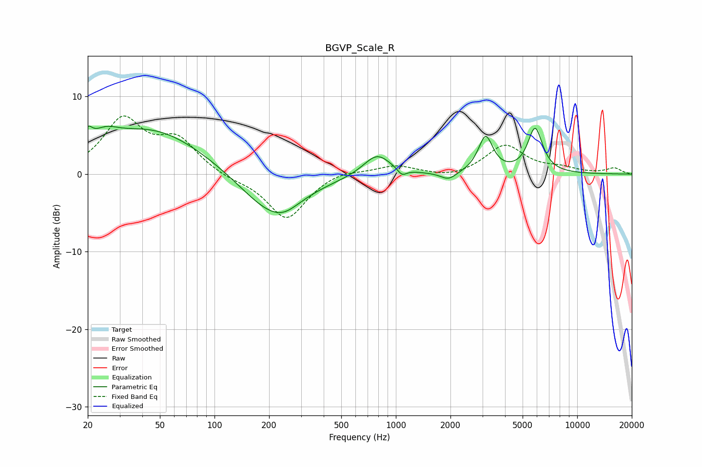

# BGVP_Scale_R
See [usage instructions](https://github.com/jaakkopasanen/AutoEq#usage) for more options and info.

### Parametric EQs
Apply preamp of -6.3 dB when using parametric equalizer.

|   # | Type    |   Fc (Hz) |    Q |   Gain (dB) |
|-----|---------|-----------|------|-------------|
|   1 | Peaking |        20 | 5.95 |         1.8 |
|   2 | Peaking |        25 | 1.95 |         1.8 |
|   3 | Peaking |        45 | 0.48 |         5.8 |
|   4 | Peaking |       205 | 0.8  |        -5.3 |
|   5 | Peaking |       242 | 1.81 |        -0.9 |
|   6 | Peaking |       788 | 1.88 |         2.8 |
|   7 | Peaking |      1081 | 5.74 |        -0.9 |
|   8 | Peaking |      1953 | 3.24 |        -1   |
|   9 | Peaking |      3125 | 3.56 |         4.7 |
|  10 | Peaking |      5860 | 3.39 |         5.7 |

### Fixed Band EQs
When using fixed band (also called graphic) equalizer, apply preamp of **-7.6 dB** (if available) and set gains manually with these parameters.

|   # | Type    |   Fc (Hz) |    Q |   Gain (dB) |
|-----|---------|-----------|------|-------------|
|   1 | Peaking |        31 | 1.41 |         6.8 |
|   2 | Peaking |        62 | 1.41 |         4.1 |
|   3 | Peaking |       125 | 1.41 |        -0.6 |
|   4 | Peaking |       250 | 1.41 |        -5.8 |
|   5 | Peaking |       500 | 1.41 |         0.7 |
|   6 | Peaking |      1000 | 1.41 |         1.1 |
|   7 | Peaking |      2000 | 1.41 |        -0.6 |
|   8 | Peaking |      4000 | 1.41 |         3.7 |
|   9 | Peaking |      8000 | 1.41 |         0.6 |
|  10 | Peaking |     16000 | 1.41 |         0.7 |

### Graphs

