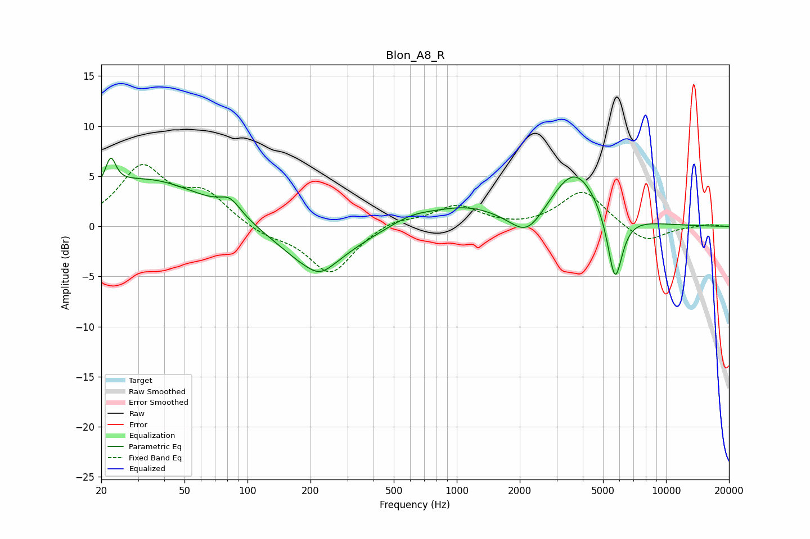

# Blon_A8_R
See [usage instructions](https://github.com/jaakkopasanen/AutoEq#usage) for more options and info.

### Parametric EQs
Apply preamp of -6.9 dB when using parametric equalizer.

|   # | Type    |   Fc (Hz) |    Q |   Gain (dB) |
|-----|---------|-----------|------|-------------|
|   1 | Peaking |        22 | 5.81 |         2.8 |
|   2 | Peaking |        33 | 0.48 |         4.7 |
|   3 | Peaking |        83 | 2.75 |         1.5 |
|   4 | Peaking |       209 | 0.83 |        -4.3 |
|   5 | Peaking |       223 | 2.44 |        -0.9 |
|   6 | Peaking |       610 | 1.26 |         1   |
|   7 | Peaking |      1108 | 0.84 |         1.7 |
|   8 | Peaking |      2173 | 1.73 |        -2.7 |
|   9 | Peaking |      3668 | 1.18 |         5.8 |
|  10 | Peaking |      5704 | 3.84 |        -7.2 |

### Fixed Band EQs
When using fixed band (also called graphic) equalizer, apply preamp of **-6.3 dB** (if available) and set gains manually with these parameters.

|   # | Type    |   Fc (Hz) |    Q |   Gain (dB) |
|-----|---------|-----------|------|-------------|
|   1 | Peaking |        31 | 1.41 |         5.7 |
|   2 | Peaking |        62 | 1.41 |         3   |
|   3 | Peaking |       125 | 1.41 |        -0.9 |
|   4 | Peaking |       250 | 1.41 |        -4.7 |
|   5 | Peaking |       500 | 1.41 |         0.8 |
|   6 | Peaking |      1000 | 1.41 |         2   |
|   7 | Peaking |      2000 | 1.41 |        -0.2 |
|   8 | Peaking |      4000 | 1.41 |         3.6 |
|   9 | Peaking |      8000 | 1.41 |        -1.7 |
|  10 | Peaking |     16000 | 1.41 |         0.2 |

### Graphs

