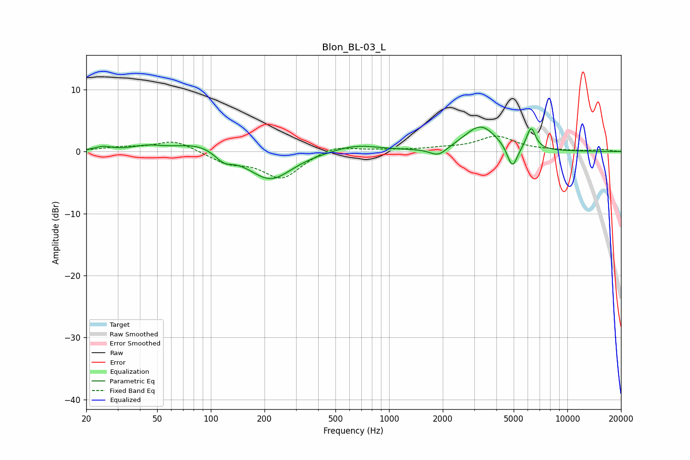

# Blon_BL-03_L
See [usage instructions](https://github.com/jaakkopasanen/AutoEq#usage) for more options and info.

### Parametric EQs
Apply preamp of -4.0 dB when using parametric equalizer.

|   # | Type    |   Fc (Hz) |    Q |   Gain (dB) |
|-----|---------|-----------|------|-------------|
|   1 | Peaking |        25 | 3.11 |         0.6 |
|   2 | Peaking |        44 | 1.71 |         0.8 |
|   3 | Peaking |        86 | 1.09 |         1.5 |
|   4 | Peaking |       118 | 2.9  |        -1.5 |
|   5 | Peaking |       216 | 1.17 |        -4.6 |
|   6 | Peaking |       648 | 1.07 |         1.2 |
|   7 | Peaking |      1891 | 2.97 |        -1.4 |
|   8 | Peaking |      3262 | 1.56 |         4.2 |
|   9 | Peaking |      4914 | 4.84 |        -3.8 |
|  10 | Peaking |      6259 | 5.42 |         3.6 |

### Fixed Band EQs
When using fixed band (also called graphic) equalizer, apply preamp of **-2.6 dB** (if available) and set gains manually with these parameters.

|   # | Type    |   Fc (Hz) |    Q |   Gain (dB) |
|-----|---------|-----------|------|-------------|
|   1 | Peaking |        31 | 1.41 |         0.6 |
|   2 | Peaking |        62 | 1.41 |         1.8 |
|   3 | Peaking |       125 | 1.41 |        -1.7 |
|   4 | Peaking |       250 | 1.41 |        -4.2 |
|   5 | Peaking |       500 | 1.41 |         1.2 |
|   6 | Peaking |      1000 | 1.41 |         0.2 |
|   7 | Peaking |      2000 | 1.41 |         0.4 |
|   8 | Peaking |      4000 | 1.41 |         2.4 |
|   9 | Peaking |      8000 | 1.41 |         0.1 |
|  10 | Peaking |     16000 | 1.41 |         0.3 |

### Graphs

