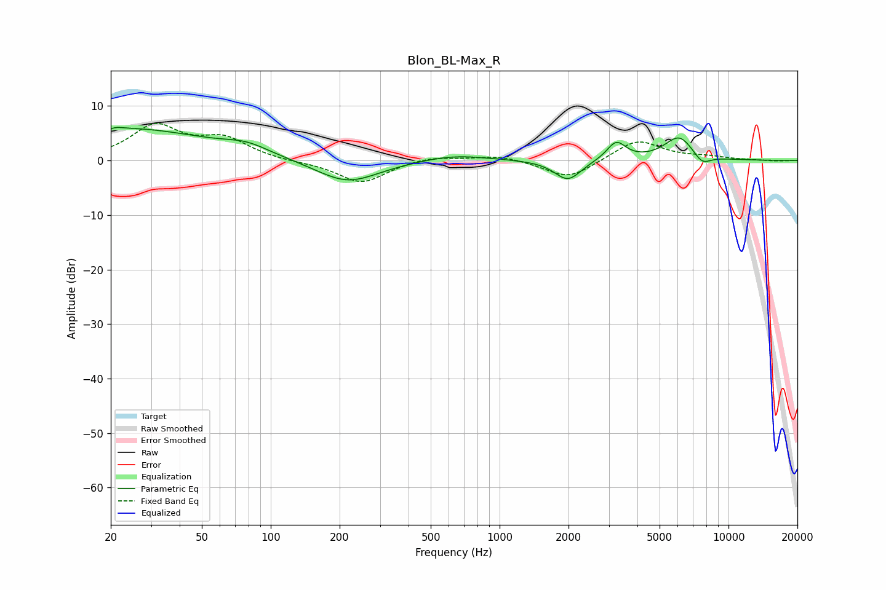

# Blon_BL-Max_R
See [usage instructions](https://github.com/jaakkopasanen/AutoEq#usage) for more options and info.

### Parametric EQs
Apply preamp of -6.2 dB when using parametric equalizer.

|   # | Type    |   Fc (Hz) |    Q |   Gain (dB) |
|-----|---------|-----------|------|-------------|
|   1 | Peaking |        20 | 5.97 |        -3.4 |
|   2 | Peaking |        20 | 5.58 |         3.4 |
|   3 | Peaking |        23 | 0.36 |         5.8 |
|   4 | Peaking |        79 | 1.49 |         1.5 |
|   5 | Peaking |       216 | 1.02 |        -4.3 |
|   6 | Peaking |       631 | 0.96 |         1.2 |
|   7 | Peaking |      1987 | 2.44 |        -3.8 |
|   8 | Peaking |      3234 | 3.39 |         3.4 |
|   9 | Peaking |      6090 | 2.13 |         4.5 |
|  10 | Peaking |      7655 | 3.51 |        -1.9 |

### Fixed Band EQs
When using fixed band (also called graphic) equalizer, apply preamp of **-6.9 dB** (if available) and set gains manually with these parameters.

|   # | Type    |   Fc (Hz) |    Q |   Gain (dB) |
|-----|---------|-----------|------|-------------|
|   1 | Peaking |        31 | 1.41 |         6.2 |
|   2 | Peaking |        62 | 1.41 |         3.7 |
|   3 | Peaking |       125 | 1.41 |        -0.2 |
|   4 | Peaking |       250 | 1.41 |        -4.2 |
|   5 | Peaking |       500 | 1.41 |         0.9 |
|   6 | Peaking |      1000 | 1.41 |         1   |
|   7 | Peaking |      2000 | 1.41 |        -3.5 |
|   8 | Peaking |      4000 | 1.41 |         3.9 |
|   9 | Peaking |      8000 | 1.41 |         0.6 |
|  10 | Peaking |     16000 | 1.41 |        -0.1 |

### Graphs

