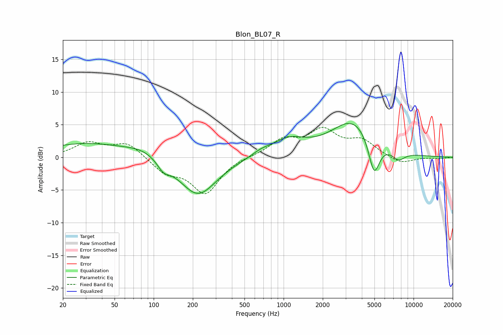

# Blon_BL07_R
See [usage instructions](https://github.com/jaakkopasanen/AutoEq#usage) for more options and info.

### Parametric EQs
Apply preamp of -5.3 dB when using parametric equalizer.

|   # | Type    |   Fc (Hz) |    Q |   Gain (dB) |
|-----|---------|-----------|------|-------------|
|   1 | Peaking |        30 | 0.45 |         2.1 |
|   2 | Peaking |        85 | 1.01 |         1.2 |
|   3 | Peaking |       119 | 2.96 |        -1.4 |
|   4 | Peaking |       219 | 0.98 |        -5.9 |
|   5 | Peaking |       670 | 2.04 |         0.6 |
|   6 | Peaking |      1104 | 1.06 |         2.6 |
|   7 | Peaking |      1324 | 1.18 |        -0.2 |
|   8 | Peaking |      3458 | 0.83 |         5.7 |
|   9 | Peaking |      4965 | 3.22 |        -5.8 |
|  10 | Peaking |      7635 | 2.62 |        -1.5 |

### Fixed Band EQs
When using fixed band (also called graphic) equalizer, apply preamp of **-4.7 dB** (if available) and set gains manually with these parameters.

|   # | Type    |   Fc (Hz) |    Q |   Gain (dB) |
|-----|---------|-----------|------|-------------|
|   1 | Peaking |        31 | 1.41 |         2.1 |
|   2 | Peaking |        62 | 1.41 |         2.2 |
|   3 | Peaking |       125 | 1.41 |        -2.2 |
|   4 | Peaking |       250 | 1.41 |        -5.4 |
|   5 | Peaking |       500 | 1.41 |         0.2 |
|   6 | Peaking |      1000 | 1.41 |         2.5 |
|   7 | Peaking |      2000 | 1.41 |         3.8 |
|   8 | Peaking |      4000 | 1.41 |         2.3 |
|   9 | Peaking |      8000 | 1.41 |        -1.1 |
|  10 | Peaking |     16000 | 1.41 |        -0.2 |

### Graphs

