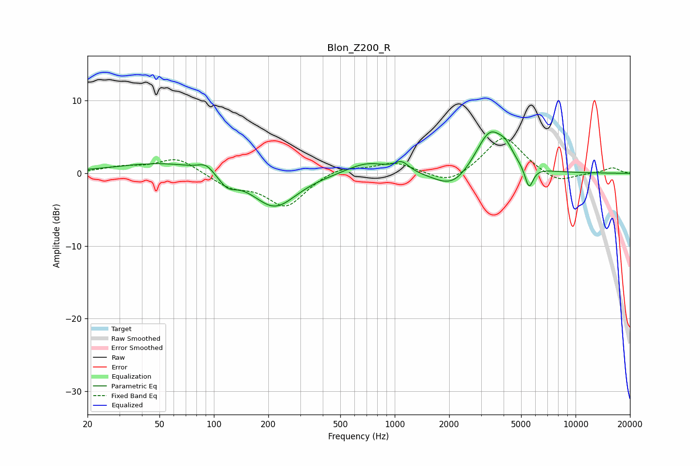

# Blon_Z200_R
See [usage instructions](https://github.com/jaakkopasanen/AutoEq#usage) for more options and info.

### Parametric EQs
Apply preamp of -5.8 dB when using parametric equalizer.

|   # | Type    |   Fc (Hz) |    Q |   Gain (dB) |
|-----|---------|-----------|------|-------------|
|   1 | Peaking |        54 | 0.55 |         1.5 |
|   2 | Peaking |        90 | 3.26 |         1.1 |
|   3 | Peaking |       119 | 2.9  |        -1.6 |
|   4 | Peaking |       217 | 1.16 |        -4.8 |
|   5 | Peaking |       703 | 1.25 |         1.6 |
|   6 | Peaking |      1095 | 3.55 |         1.3 |
|   7 | Peaking |      2097 | 1.4  |        -2.6 |
|   8 | Peaking |      3368 | 1.73 |         6.2 |
|   9 | Peaking |      4116 | 3.84 |         1.3 |
|  10 | Peaking |      5528 | 5.99 |        -3.1 |

### Fixed Band EQs
When using fixed band (also called graphic) equalizer, apply preamp of **-4.9 dB** (if available) and set gains manually with these parameters.

|   # | Type    |   Fc (Hz) |    Q |   Gain (dB) |
|-----|---------|-----------|------|-------------|
|   1 | Peaking |        31 | 1.41 |         0.8 |
|   2 | Peaking |        62 | 1.41 |         2.2 |
|   3 | Peaking |       125 | 1.41 |        -1.7 |
|   4 | Peaking |       250 | 1.41 |        -4.5 |
|   5 | Peaking |       500 | 1.41 |         1   |
|   6 | Peaking |      1000 | 1.41 |         1.5 |
|   7 | Peaking |      2000 | 1.41 |        -1.7 |
|   8 | Peaking |      4000 | 1.41 |         5.2 |
|   9 | Peaking |      8000 | 1.41 |        -1.5 |
|  10 | Peaking |     16000 | 1.41 |         0.8 |

### Graphs

