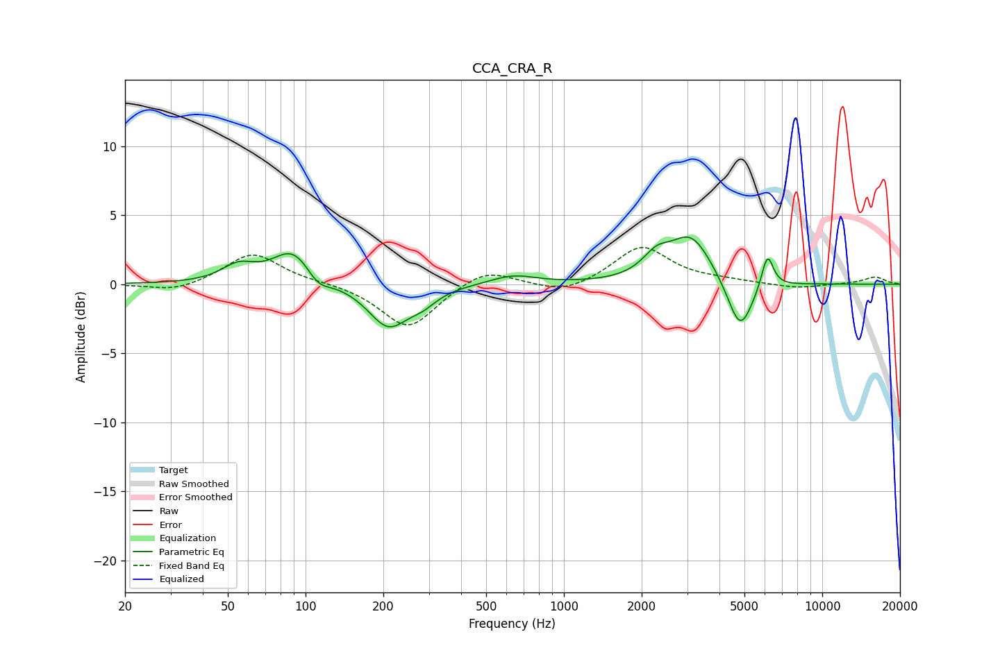

# CCA_CRA_R
See [usage instructions](https://github.com/jaakkopasanen/AutoEq#usage) for more options and info.

### Parametric EQs
Apply preamp of -3.5 dB when using parametric equalizer.

|   # | Type    |   Fc (Hz) |    Q |   Gain (dB) |
|-----|---------|-----------|------|-------------|
|   1 | Peaking |        55 | 2.2  |         1.2 |
|   2 | Peaking |        90 | 1.79 |         2.5 |
|   3 | Peaking |       112 | 3.05 |        -1   |
|   4 | Peaking |       209 | 1.81 |        -3.1 |
|   5 | Peaking |       284 | 2.56 |        -0.8 |
|   6 | Peaking |       636 | 1.6  |         0.7 |
|   7 | Peaking |      2282 | 2.6  |         1.4 |
|   8 | Peaking |      3109 | 1.73 |         3.4 |
|   9 | Peaking |      4811 | 2.86 |        -3.8 |
|  10 | Peaking |      6136 | 6    |         2.5 |

### Fixed Band EQs
When using fixed band (also called graphic) equalizer, apply preamp of **-2.8 dB** (if available) and set gains manually with these parameters.

|   # | Type    |   Fc (Hz) |    Q |   Gain (dB) |
|-----|---------|-----------|------|-------------|
|   1 | Peaking |        31 | 1.41 |        -0.6 |
|   2 | Peaking |        62 | 1.41 |         2.3 |
|   3 | Peaking |       125 | 1.41 |         0.1 |
|   4 | Peaking |       250 | 1.41 |        -3.3 |
|   5 | Peaking |       500 | 1.41 |         1.2 |
|   6 | Peaking |      1000 | 1.41 |        -0.8 |
|   7 | Peaking |      2000 | 1.41 |         2.7 |
|   8 | Peaking |      4000 | 1.41 |         0.2 |
|   9 | Peaking |      8000 | 1.41 |        -0.3 |
|  10 | Peaking |     16000 | 1.41 |         0.5 |

### Graphs

