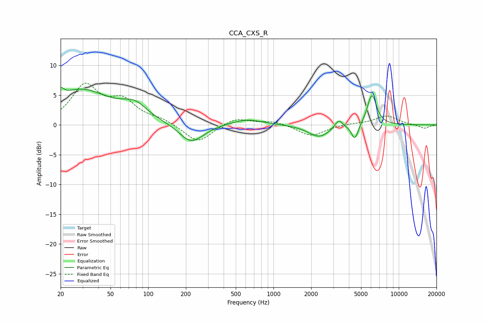

# CCA_CXS_R
See [usage instructions](https://github.com/jaakkopasanen/AutoEq#usage) for more options and info.

### Parametric EQs
Apply preamp of -6.4 dB when using parametric equalizer.

|   # | Type    |   Fc (Hz) |    Q |   Gain (dB) |
|-----|---------|-----------|------|-------------|
|   1 | Peaking |        20 | 5.99 |         1.4 |
|   2 | Peaking |        29 | 0.6  |         5.8 |
|   3 | Peaking |        78 | 1.41 |         2.3 |
|   4 | Peaking |       216 | 1.56 |        -2.6 |
|   5 | Peaking |       244 | 1.46 |        -0.7 |
|   6 | Peaking |       614 | 1.12 |         1   |
|   7 | Peaking |      2321 | 1.64 |        -2.1 |
|   8 | Peaking |      3311 | 4.54 |         1.5 |
|   9 | Peaking |      4467 | 4.94 |        -2.7 |
|  10 | Peaking |      6101 | 3.73 |         5.2 |

### Fixed Band EQs
When using fixed band (also called graphic) equalizer, apply preamp of **-7.1 dB** (if available) and set gains manually with these parameters.

|   # | Type    |   Fc (Hz) |    Q |   Gain (dB) |
|-----|---------|-----------|------|-------------|
|   1 | Peaking |        31 | 1.41 |         6.3 |
|   2 | Peaking |        62 | 1.41 |         3.6 |
|   3 | Peaking |       125 | 1.41 |         0.8 |
|   4 | Peaking |       250 | 1.41 |        -3.1 |
|   5 | Peaking |       500 | 1.41 |         1.3 |
|   6 | Peaking |      1000 | 1.41 |         0.6 |
|   7 | Peaking |      2000 | 1.41 |        -1.9 |
|   8 | Peaking |      4000 | 1.41 |         0.2 |
|   9 | Peaking |      8000 | 1.41 |         1.5 |
|  10 | Peaking |     16000 | 1.41 |        -0.6 |

### Graphs

