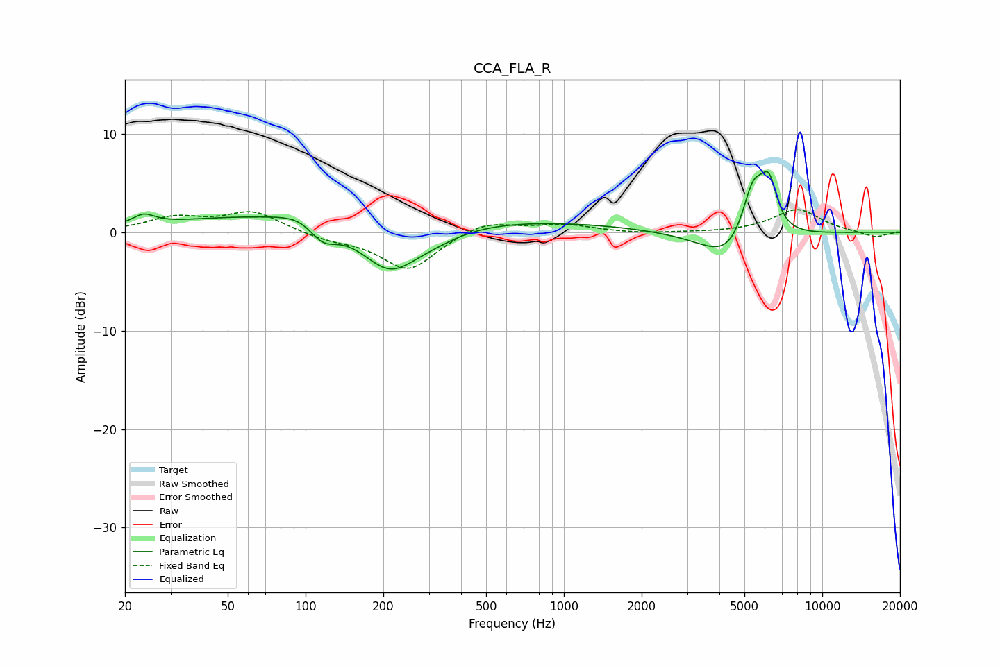

# CCA_FLA_R
See [usage instructions](https://github.com/jaakkopasanen/AutoEq#usage) for more options and info.

### Parametric EQs
Apply preamp of -6.3 dB when using parametric equalizer.

|   # | Type    |   Fc (Hz) |    Q |   Gain (dB) |
|-----|---------|-----------|------|-------------|
|   1 | Peaking |        24 | 3.3  |         1.1 |
|   2 | Peaking |        48 | 0.51 |         1   |
|   3 | Peaking |        99 | 1.55 |         1.2 |
|   4 | Peaking |       116 | 2.54 |        -2.1 |
|   5 | Peaking |       212 | 1.26 |        -4.9 |
|   6 | Peaking |       316 | 1.3  |        -0.9 |
|   7 | Peaking |       322 | 0.18 |         1.4 |
|   8 | Peaking |      4527 | 1.24 |        -3.7 |
|   9 | Peaking |      5406 | 2.87 |         6.6 |
|  10 | Peaking |      6230 | 4.38 |         4.4 |

### Fixed Band EQs
When using fixed band (also called graphic) equalizer, apply preamp of **-2.4 dB** (if available) and set gains manually with these parameters.

|   # | Type    |   Fc (Hz) |    Q |   Gain (dB) |
|-----|---------|-----------|------|-------------|
|   1 | Peaking |        31 | 1.41 |         1.4 |
|   2 | Peaking |        62 | 1.41 |         2.1 |
|   3 | Peaking |       125 | 1.41 |        -0.7 |
|   4 | Peaking |       250 | 1.41 |        -3.9 |
|   5 | Peaking |       500 | 1.41 |         1.2 |
|   6 | Peaking |      1000 | 1.41 |         0.7 |
|   7 | Peaking |      2000 | 1.41 |        -0.2 |
|   8 | Peaking |      4000 | 1.41 |        -0.1 |
|   9 | Peaking |      8000 | 1.41 |         2.3 |
|  10 | Peaking |     16000 | 1.41 |        -0.6 |

### Graphs

