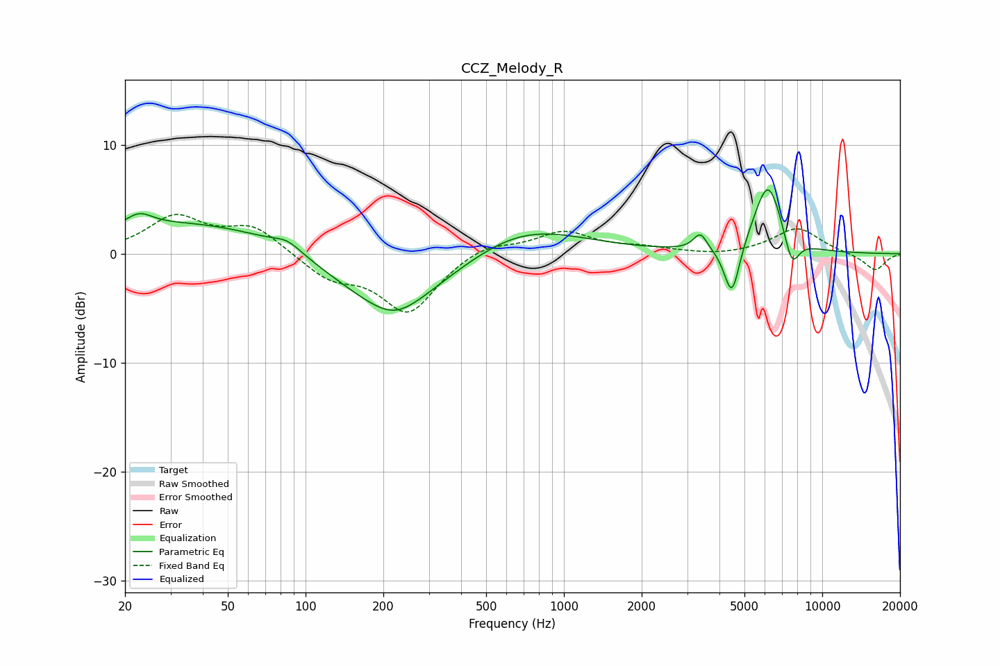

# CCZ_Melody_R
See [usage instructions](https://github.com/jaakkopasanen/AutoEq#usage) for more options and info.

### Parametric EQs
Apply preamp of -6.0 dB when using parametric equalizer.

|   # | Type    |   Fc (Hz) |    Q |   Gain (dB) |
|-----|---------|-----------|------|-------------|
|   1 | Peaking |        23 | 2.87 |         1.2 |
|   2 | Peaking |        41 | 0.31 |         3.1 |
|   3 | Peaking |        85 | 2.61 |         0.9 |
|   4 | Peaking |       211 | 0.58 |        -5.5 |
|   5 | Peaking |       222 | 1.51 |        -1.3 |
|   6 | Peaking |       684 | 0.61 |         2.9 |
|   7 | Peaking |      3374 | 5.42 |         1.5 |
|   8 | Peaking |      4471 | 4.6  |        -5   |
|   9 | Peaking |      6166 | 2.43 |         6.7 |
|  10 | Peaking |      7620 | 4.61 |        -3   |

### Fixed Band EQs
When using fixed band (also called graphic) equalizer, apply preamp of **-3.7 dB** (if available) and set gains manually with these parameters.

|   # | Type    |   Fc (Hz) |    Q |   Gain (dB) |
|-----|---------|-----------|------|-------------|
|   1 | Peaking |        31 | 1.41 |         3.3 |
|   2 | Peaking |        62 | 1.41 |         2.4 |
|   3 | Peaking |       125 | 1.41 |        -2.1 |
|   4 | Peaking |       250 | 1.41 |        -5.3 |
|   5 | Peaking |       500 | 1.41 |         1.1 |
|   6 | Peaking |      1000 | 1.41 |         2   |
|   7 | Peaking |      2000 | 1.41 |         0.5 |
|   8 | Peaking |      4000 | 1.41 |        -0.2 |
|   9 | Peaking |      8000 | 1.41 |         2.4 |
|  10 | Peaking |     16000 | 1.41 |        -1.6 |

### Graphs

