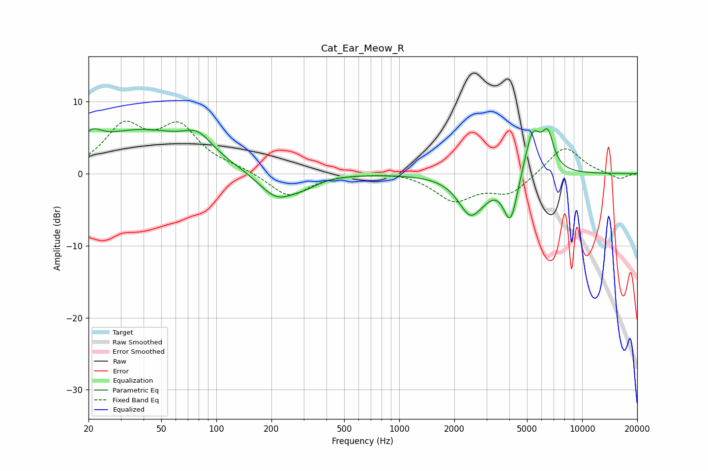

# Cat_Ear_Meow_R
See [usage instructions](https://github.com/jaakkopasanen/AutoEq#usage) for more options and info.

### Parametric EQs
Apply preamp of -6.3 dB when using parametric equalizer.

|   # | Type    |   Fc (Hz) |    Q |   Gain (dB) |
|-----|---------|-----------|------|-------------|
|   1 | Peaking |        21 | 2.85 |         2   |
|   2 | Peaking |        39 | 0.49 |         5.8 |
|   3 | Peaking |        79 | 1.82 |         2.5 |
|   4 | Peaking |       215 | 1.37 |        -3.8 |
|   5 | Peaking |       308 | 2.02 |        -0.8 |
|   6 | Peaking |      2449 | 2.11 |        -5.3 |
|   7 | Peaking |      2923 | 3.53 |        -0.5 |
|   8 | Peaking |      4061 | 3.53 |        -6.8 |
|   9 | Peaking |      5366 | 3.05 |         6.4 |
|  10 | Peaking |      6496 | 4.31 |         4.5 |

### Fixed Band EQs
When using fixed band (also called graphic) equalizer, apply preamp of **-7.4 dB** (if available) and set gains manually with these parameters.

|   # | Type    |   Fc (Hz) |    Q |   Gain (dB) |
|-----|---------|-----------|------|-------------|
|   1 | Peaking |        31 | 1.41 |         6.1 |
|   2 | Peaking |        62 | 1.41 |         6   |
|   3 | Peaking |       125 | 1.41 |         0.6 |
|   4 | Peaking |       250 | 1.41 |        -3.3 |
|   5 | Peaking |       500 | 1.41 |         0.1 |
|   6 | Peaking |      1000 | 1.41 |         0.4 |
|   7 | Peaking |      2000 | 1.41 |        -3.6 |
|   8 | Peaking |      4000 | 1.41 |        -2.7 |
|   9 | Peaking |      8000 | 1.41 |         4   |
|  10 | Peaking |     16000 | 1.41 |        -0.8 |

### Graphs

