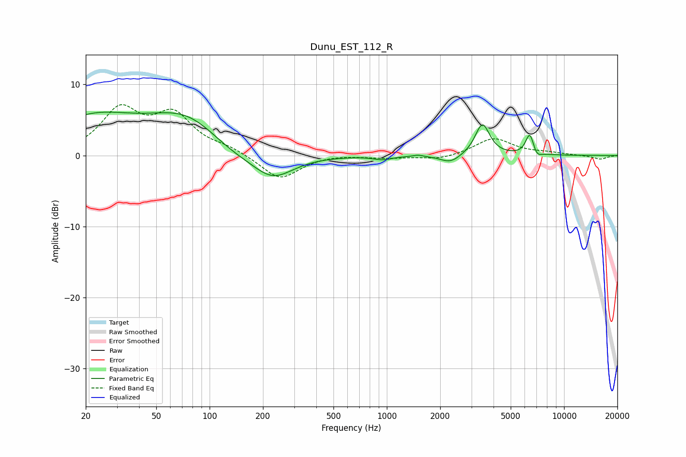

# Dunu_EST_112_R
See [usage instructions](https://github.com/jaakkopasanen/AutoEq#usage) for more options and info.

### Parametric EQs
Apply preamp of -6.2 dB when using parametric equalizer.

|   # | Type    |   Fc (Hz) |    Q |   Gain (dB) |
|-----|---------|-----------|------|-------------|
|   1 | Peaking |        22 | 0.56 |         5   |
|   2 | Peaking |        76 | 0.65 |         5.4 |
|   3 | Peaking |       129 | 0.93 |        -1.7 |
|   4 | Peaking |       226 | 1.19 |        -3.6 |
|   5 | Peaking |       946 | 2.74 |        -0.5 |
|   6 | Peaking |      1500 | 5.41 |         0.2 |
|   7 | Peaking |      2285 | 2.51 |        -1.2 |
|   8 | Peaking |      3461 | 3.47 |         4.5 |
|   9 | Peaking |      6405 | 5.94 |         3   |
|  10 | Peaking |      7016 | 5.85 |        -0.8 |

### Fixed Band EQs
When using fixed band (also called graphic) equalizer, apply preamp of **-7.3 dB** (if available) and set gains manually with these parameters.

|   # | Type    |   Fc (Hz) |    Q |   Gain (dB) |
|-----|---------|-----------|------|-------------|
|   1 | Peaking |        31 | 1.41 |         6.1 |
|   2 | Peaking |        62 | 1.41 |         5.3 |
|   3 | Peaking |       125 | 1.41 |         0.9 |
|   4 | Peaking |       250 | 1.41 |        -3.4 |
|   5 | Peaking |       500 | 1.41 |         0.2 |
|   6 | Peaking |      1000 | 1.41 |        -0.3 |
|   7 | Peaking |      2000 | 1.41 |        -0.6 |
|   8 | Peaking |      4000 | 1.41 |         2.4 |
|   9 | Peaking |      8000 | 1.41 |         0.3 |
|  10 | Peaking |     16000 | 1.41 |        -0.5 |

### Graphs

