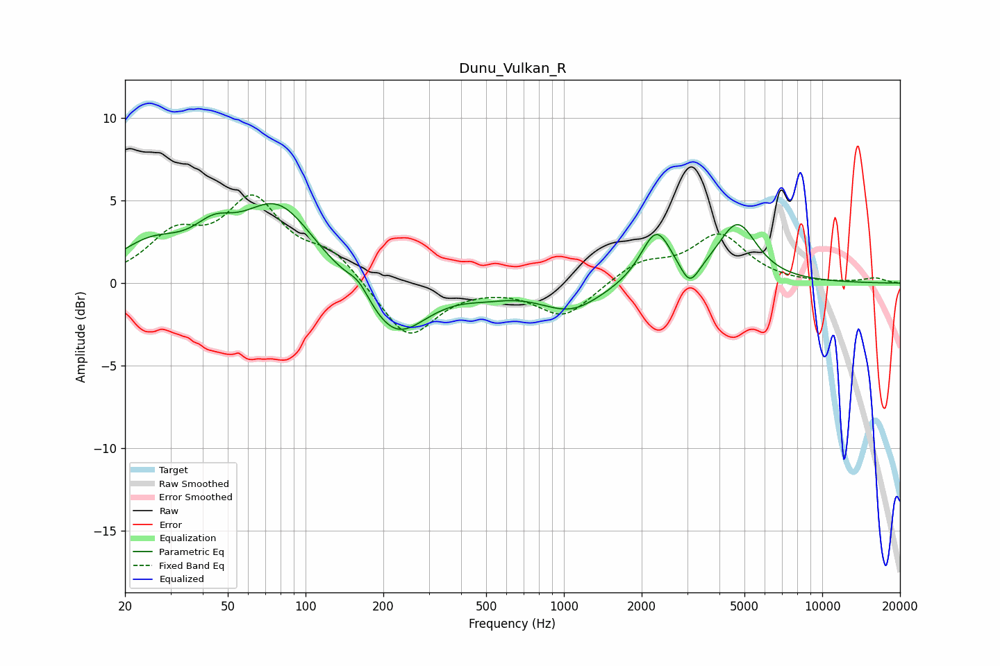

# Dunu_Vulkan_R
See [usage instructions](https://github.com/jaakkopasanen/AutoEq#usage) for more options and info.

### Parametric EQs
Apply preamp of -4.9 dB when using parametric equalizer.

|   # | Type    |   Fc (Hz) |    Q |   Gain (dB) |
|-----|---------|-----------|------|-------------|
|   1 | Peaking |        25 | 1.1  |         2   |
|   2 | Peaking |        44 | 1.81 |         1.6 |
|   3 | Peaking |        78 | 0.99 |         4.6 |
|   4 | Peaking |       161 | 3.31 |         0.8 |
|   5 | Peaking |       222 | 1.18 |        -3.5 |
|   6 | Peaking |       498 | 1.55 |        -0.3 |
|   7 | Peaking |      1065 | 1.17 |        -1.6 |
|   8 | Peaking |      2278 | 2.41 |         3.2 |
|   9 | Peaking |      3070 | 3.94 |        -1.4 |
|  10 | Peaking |      4696 | 1.86 |         3.5 |

### Fixed Band EQs
When using fixed band (also called graphic) equalizer, apply preamp of **-5.4 dB** (if available) and set gains manually with these parameters.

|   # | Type    |   Fc (Hz) |    Q |   Gain (dB) |
|-----|---------|-----------|------|-------------|
|   1 | Peaking |        31 | 1.41 |         2.6 |
|   2 | Peaking |        62 | 1.41 |         4.7 |
|   3 | Peaking |       125 | 1.41 |         1.7 |
|   4 | Peaking |       250 | 1.41 |        -3.4 |
|   5 | Peaking |       500 | 1.41 |        -0   |
|   6 | Peaking |      1000 | 1.41 |        -2.1 |
|   7 | Peaking |      2000 | 1.41 |         1.2 |
|   8 | Peaking |      4000 | 1.41 |         2.8 |
|   9 | Peaking |      8000 | 1.41 |        -0   |
|  10 | Peaking |     16000 | 1.41 |         0.3 |

### Graphs

