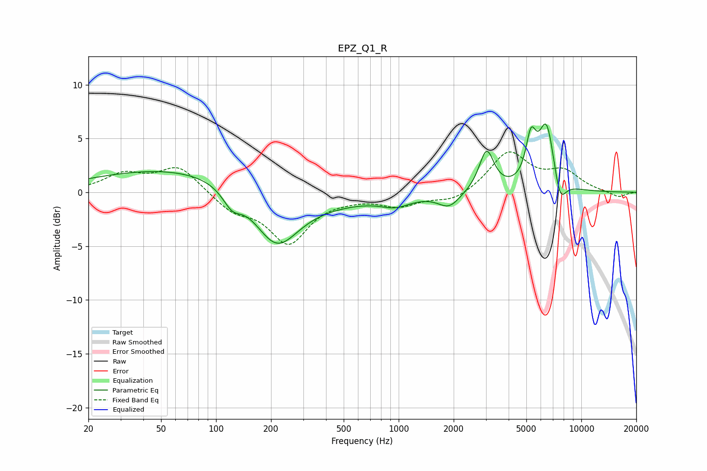

# EPZ_Q1_R
See [usage instructions](https://github.com/jaakkopasanen/AutoEq#usage) for more options and info.

### Parametric EQs
Apply preamp of -6.4 dB when using parametric equalizer.

|   # | Type    |   Fc (Hz) |    Q |   Gain (dB) |
|-----|---------|-----------|------|-------------|
|   1 | Peaking |        76 | 0.26 |         2.4 |
|   2 | Peaking |       122 | 2.77 |        -1.6 |
|   3 | Peaking |       213 | 1.15 |        -5.2 |
|   4 | Peaking |       337 | 0.5  |        -1.3 |
|   5 | Peaking |       960 | 1.74 |        -0.9 |
|   6 | Peaking |      1889 | 2.38 |        -1.3 |
|   7 | Peaking |      3027 | 3.49 |         3.8 |
|   8 | Peaking |      5301 | 4.96 |         3.9 |
|   9 | Peaking |      6454 | 3.09 |         6.2 |
|  10 | Peaking |      7632 | 4.03 |        -2.6 |

### Fixed Band EQs
When using fixed band (also called graphic) equalizer, apply preamp of **-3.8 dB** (if available) and set gains manually with these parameters.

|   # | Type    |   Fc (Hz) |    Q |   Gain (dB) |
|-----|---------|-----------|------|-------------|
|   1 | Peaking |        31 | 1.41 |         1.6 |
|   2 | Peaking |        62 | 1.41 |         2.4 |
|   3 | Peaking |       125 | 1.41 |        -1.6 |
|   4 | Peaking |       250 | 1.41 |        -4.6 |
|   5 | Peaking |       500 | 1.41 |        -0.3 |
|   6 | Peaking |      1000 | 1.41 |        -1.2 |
|   7 | Peaking |      2000 | 1.41 |        -0.9 |
|   8 | Peaking |      4000 | 1.41 |         3.7 |
|   9 | Peaking |      8000 | 1.41 |         1.7 |
|  10 | Peaking |     16000 | 1.41 |        -0.5 |

### Graphs

