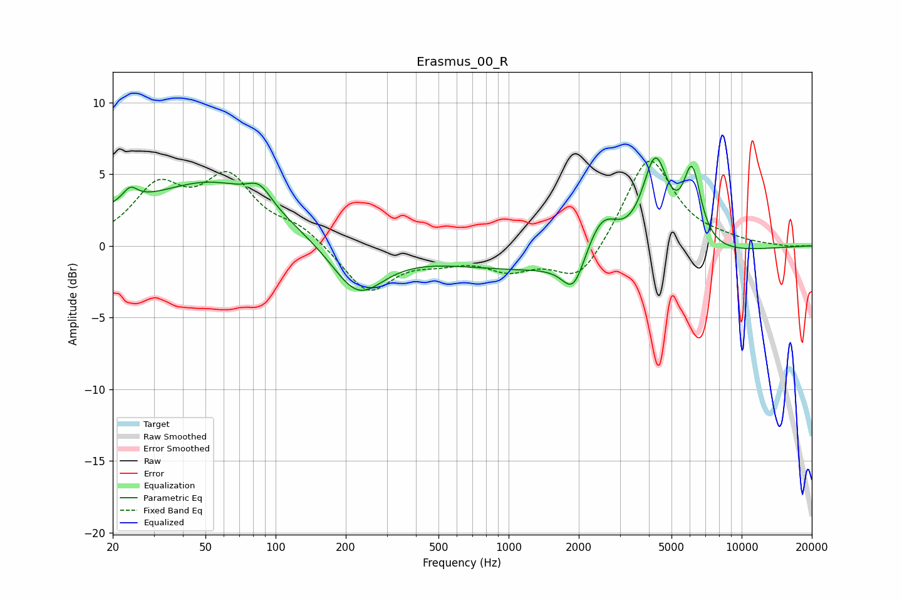

# Erasmus_00_R
See [usage instructions](https://github.com/jaakkopasanen/AutoEq#usage) for more options and info.

### Parametric EQs
Apply preamp of -6.2 dB when using parametric equalizer.

|   # | Type    |   Fc (Hz) |    Q |   Gain (dB) |
|-----|---------|-----------|------|-------------|
|   1 | Peaking |        20 | 0.99 |         1.1 |
|   2 | Peaking |        24 | 4.81 |         0.9 |
|   3 | Peaking |        53 | 0.53 |         4.2 |
|   4 | Peaking |        85 | 2.74 |         1.3 |
|   5 | Peaking |       225 | 1.27 |        -3.6 |
|   6 | Peaking |      1901 | 2.91 |        -2.5 |
|   7 | Peaking |      2014 | 0.24 |        -1.9 |
|   8 | Peaking |      2515 | 1.88 |         3.3 |
|   9 | Peaking |      4259 | 2.44 |         6.7 |
|  10 | Peaking |      6128 | 3.6  |         5.3 |

### Fixed Band EQs
When using fixed band (also called graphic) equalizer, apply preamp of **-6.0 dB** (if available) and set gains manually with these parameters.

|   # | Type    |   Fc (Hz) |    Q |   Gain (dB) |
|-----|---------|-----------|------|-------------|
|   1 | Peaking |        31 | 1.41 |         3.8 |
|   2 | Peaking |        62 | 1.41 |         4.4 |
|   3 | Peaking |       125 | 1.41 |         1.2 |
|   4 | Peaking |       250 | 1.41 |        -3.3 |
|   5 | Peaking |       500 | 1.41 |        -0.8 |
|   6 | Peaking |      1000 | 1.41 |        -1.5 |
|   7 | Peaking |      2000 | 1.41 |        -2.6 |
|   8 | Peaking |      4000 | 1.41 |         6.4 |
|   9 | Peaking |      8000 | 1.41 |         0.3 |
|  10 | Peaking |     16000 | 1.41 |        -0.1 |

### Graphs

