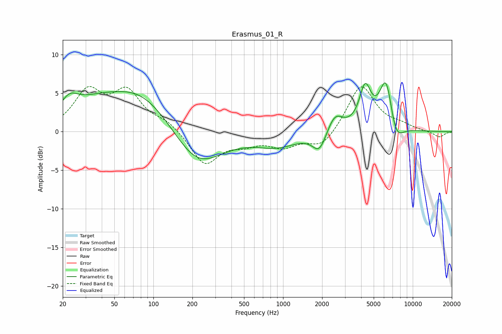

# Erasmus_01_R
See [usage instructions](https://github.com/jaakkopasanen/AutoEq#usage) for more options and info.

### Parametric EQs
Apply preamp of -6.4 dB when using parametric equalizer.

|   # | Type    |   Fc (Hz) |    Q |   Gain (dB) |
|-----|---------|-----------|------|-------------|
|   1 | Peaking |        22 | 2.1  |         2.1 |
|   2 | Peaking |        33 | 0.69 |         2.3 |
|   3 | Peaking |        81 | 0.55 |         5.1 |
|   4 | Peaking |       216 | 0.74 |        -5.2 |
|   5 | Peaking |       905 | 0.86 |        -1.7 |
|   6 | Peaking |      1907 | 2.68 |        -2.5 |
|   7 | Peaking |      2510 | 2.35 |         2.4 |
|   8 | Peaking |      4295 | 3.1  |         5.2 |
|   9 | Peaking |      6237 | 2.6  |         7.2 |
|  10 | Peaking |      7349 | 2.44 |        -3.2 |

### Fixed Band EQs
When using fixed band (also called graphic) equalizer, apply preamp of **-6.0 dB** (if available) and set gains manually with these parameters.

|   # | Type    |   Fc (Hz) |    Q |   Gain (dB) |
|-----|---------|-----------|------|-------------|
|   1 | Peaking |        31 | 1.41 |         4.9 |
|   2 | Peaking |        62 | 1.41 |         4.8 |
|   3 | Peaking |       125 | 1.41 |         1.2 |
|   4 | Peaking |       250 | 1.41 |        -4.2 |
|   5 | Peaking |       500 | 1.41 |        -1.2 |
|   6 | Peaking |      1000 | 1.41 |        -1.7 |
|   7 | Peaking |      2000 | 1.41 |        -2.1 |
|   8 | Peaking |      4000 | 1.41 |         6.1 |
|   9 | Peaking |      8000 | 1.41 |         0.6 |
|  10 | Peaking |     16000 | 1.41 |        -0.7 |

### Graphs

