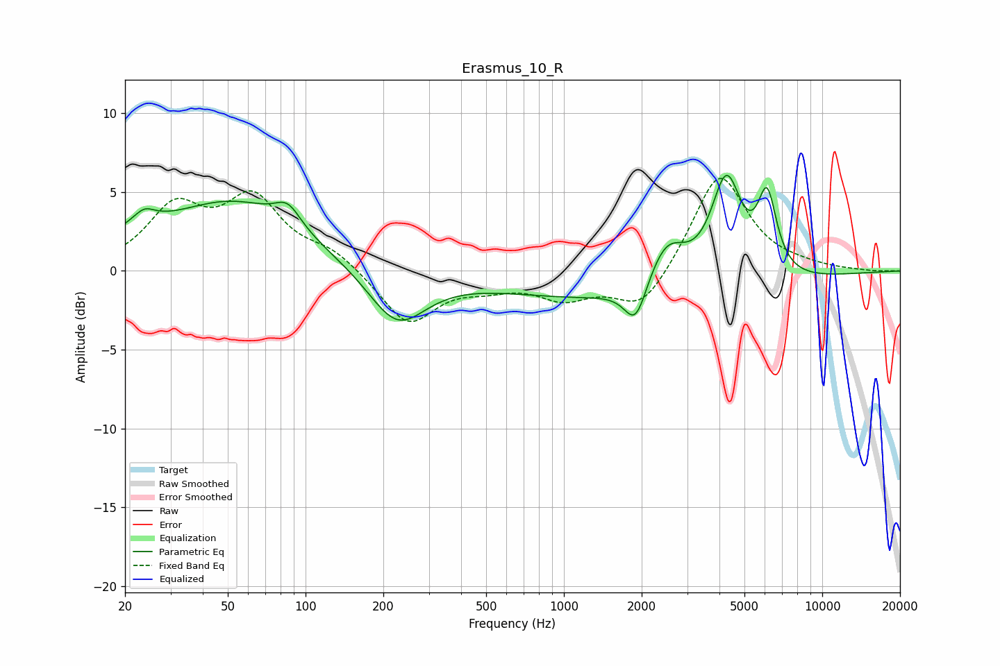

# Erasmus_10_R
See [usage instructions](https://github.com/jaakkopasanen/AutoEq#usage) for more options and info.

### Parametric EQs
Apply preamp of -6.2 dB when using parametric equalizer.

|   # | Type    |   Fc (Hz) |    Q |   Gain (dB) |
|-----|---------|-----------|------|-------------|
|   1 | Peaking |        22 | 1.39 |         1.1 |
|   2 | Peaking |        24 | 3.97 |         0.6 |
|   3 | Peaking |        52 | 0.53 |         4.3 |
|   4 | Peaking |        85 | 2.88 |         1.3 |
|   5 | Peaking |       226 | 1.26 |        -3.6 |
|   6 | Peaking |      1896 | 3.25 |        -2.6 |
|   7 | Peaking |      2035 | 0.25 |        -2   |
|   8 | Peaking |      2494 | 1.8  |         3.2 |
|   9 | Peaking |      4255 | 2.31 |         6.8 |
|  10 | Peaking |      6119 | 3.69 |         4.9 |

### Fixed Band EQs
When using fixed band (also called graphic) equalizer, apply preamp of **-6.0 dB** (if available) and set gains manually with these parameters.

|   # | Type    |   Fc (Hz) |    Q |   Gain (dB) |
|-----|---------|-----------|------|-------------|
|   1 | Peaking |        31 | 1.41 |         3.8 |
|   2 | Peaking |        62 | 1.41 |         4.3 |
|   3 | Peaking |       125 | 1.41 |         1.1 |
|   4 | Peaking |       250 | 1.41 |        -3.4 |
|   5 | Peaking |       500 | 1.41 |        -0.7 |
|   6 | Peaking |      1000 | 1.41 |        -1.5 |
|   7 | Peaking |      2000 | 1.41 |        -2.6 |
|   8 | Peaking |      4000 | 1.41 |         6.3 |
|   9 | Peaking |      8000 | 1.41 |         0.2 |
|  10 | Peaking |     16000 | 1.41 |        -0.1 |

### Graphs

