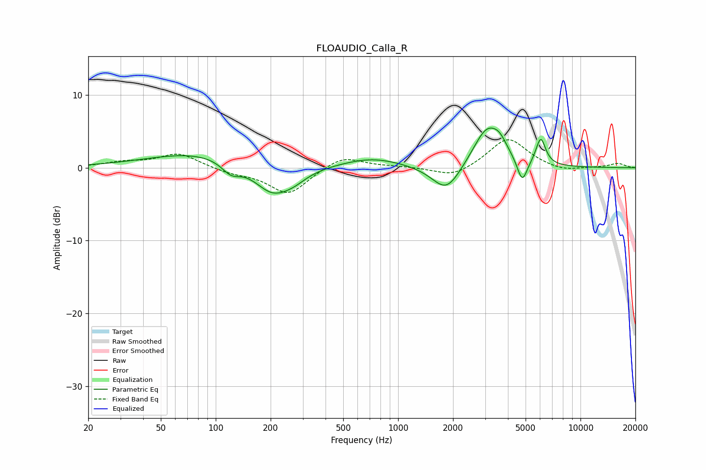

# FLOAUDIO_Calla_R
See [usage instructions](https://github.com/jaakkopasanen/AutoEq#usage) for more options and info.

### Parametric EQs
Apply preamp of -5.5 dB when using parametric equalizer.

|   # | Type    |   Fc (Hz) |    Q |   Gain (dB) |
|-----|---------|-----------|------|-------------|
|   1 | Peaking |        82 | 0.5  |         2.1 |
|   2 | Peaking |       121 | 2.73 |        -1.6 |
|   3 | Peaking |       204 | 1.4  |        -3.9 |
|   4 | Peaking |       267 | 1.87 |        -1.1 |
|   5 | Peaking |       720 | 0.86 |         1.4 |
|   6 | Peaking |      1843 | 1.78 |        -3.8 |
|   7 | Peaking |      3080 | 1.78 |         5.6 |
|   8 | Peaking |      3617 | 3.65 |         1.3 |
|   9 | Peaking |      4792 | 5.05 |        -3.3 |
|  10 | Peaking |      6053 | 5.21 |         3.7 |

### Fixed Band EQs
When using fixed band (also called graphic) equalizer, apply preamp of **-3.9 dB** (if available) and set gains manually with these parameters.

|   # | Type    |   Fc (Hz) |    Q |   Gain (dB) |
|-----|---------|-----------|------|-------------|
|   1 | Peaking |        31 | 1.41 |         0.7 |
|   2 | Peaking |        62 | 1.41 |         2   |
|   3 | Peaking |       125 | 1.41 |        -0.7 |
|   4 | Peaking |       250 | 1.41 |        -3.6 |
|   5 | Peaking |       500 | 1.41 |         1.7 |
|   6 | Peaking |      1000 | 1.41 |         0.1 |
|   7 | Peaking |      2000 | 1.41 |        -1.4 |
|   8 | Peaking |      4000 | 1.41 |         4.1 |
|   9 | Peaking |      8000 | 1.41 |        -0.6 |
|  10 | Peaking |     16000 | 1.41 |         0.6 |

### Graphs

