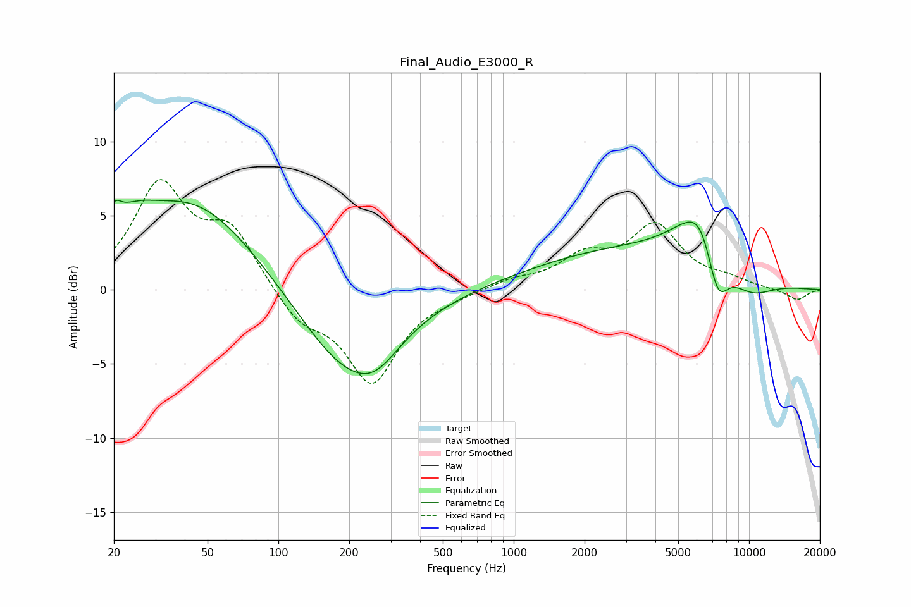

# Final_Audio_E3000_R
See [usage instructions](https://github.com/jaakkopasanen/AutoEq#usage) for more options and info.

### Parametric EQs
Apply preamp of -6.1 dB when using parametric equalizer.

|   # | Type    |   Fc (Hz) |    Q |   Gain (dB) |
|-----|---------|-----------|------|-------------|
|   1 | Peaking |        20 | 4.55 |         1.6 |
|   2 | Peaking |        24 | 1.56 |         1.6 |
|   3 | Peaking |        44 | 0.52 |         6   |
|   4 | Peaking |       194 | 0.68 |        -5.5 |
|   5 | Peaking |       258 | 1.44 |        -1.6 |
|   6 | Peaking |      3252 | 0.32 |         2.7 |
|   7 | Peaking |      5670 | 2.26 |        -1.2 |
|   8 | Peaking |      6006 | 1.58 |         5   |
|   9 | Peaking |      7340 | 2.84 |        -3.6 |
|  10 | Peaking |     10000 | 1.15 |        -1.6 |

### Fixed Band EQs
When using fixed band (also called graphic) equalizer, apply preamp of **-7.5 dB** (if available) and set gains manually with these parameters.

|   # | Type    |   Fc (Hz) |    Q |   Gain (dB) |
|-----|---------|-----------|------|-------------|
|   1 | Peaking |        31 | 1.41 |         6.9 |
|   2 | Peaking |        62 | 1.41 |         3.8 |
|   3 | Peaking |       125 | 1.41 |        -2   |
|   4 | Peaking |       250 | 1.41 |        -6.1 |
|   5 | Peaking |       500 | 1.41 |        -0.3 |
|   6 | Peaking |      1000 | 1.41 |         0.6 |
|   7 | Peaking |      2000 | 1.41 |         2   |
|   8 | Peaking |      4000 | 1.41 |         4.1 |
|   9 | Peaking |      8000 | 1.41 |         0.5 |
|  10 | Peaking |     16000 | 1.41 |        -0.7 |

### Graphs

