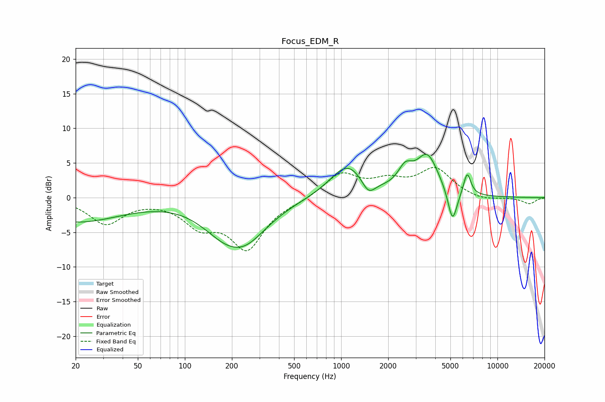

# Focus_EDM_R
See [usage instructions](https://github.com/jaakkopasanen/AutoEq#usage) for more options and info.

### Parametric EQs
Apply preamp of -6.3 dB when using parametric equalizer.

|   # | Type    |   Fc (Hz) |    Q |   Gain (dB) |
|-----|---------|-----------|------|-------------|
|   1 | Peaking |        20 | 0.48 |        -3.5 |
|   2 | Peaking |       151 | 2.43 |         0.2 |
|   3 | Peaking |       162 | 1.21 |        -2.1 |
|   4 | Peaking |       237 | 0.91 |        -6   |
|   5 | Peaking |      1101 | 1.25 |         4.8 |
|   6 | Peaking |      1495 | 3.22 |        -2.2 |
|   7 | Peaking |      2570 | 3.06 |         2.6 |
|   8 | Peaking |      3558 | 1.94 |         5.7 |
|   9 | Peaking |      5158 | 4.67 |        -4.9 |
|  10 | Peaking |      6402 | 5.89 |         3.3 |

### Fixed Band EQs
When using fixed band (also called graphic) equalizer, apply preamp of **-4.4 dB** (if available) and set gains manually with these parameters.

|   # | Type    |   Fc (Hz) |    Q |   Gain (dB) |
|-----|---------|-----------|------|-------------|
|   1 | Peaking |        31 | 1.41 |        -3.7 |
|   2 | Peaking |        62 | 1.41 |        -0.1 |
|   3 | Peaking |       125 | 1.41 |        -3.5 |
|   4 | Peaking |       250 | 1.41 |        -7   |
|   5 | Peaking |       500 | 1.41 |        -0.4 |
|   6 | Peaking |      1000 | 1.41 |         3.4 |
|   7 | Peaking |      2000 | 1.41 |         2   |
|   8 | Peaking |      4000 | 1.41 |         4   |
|   9 | Peaking |      8000 | 1.41 |        -0.5 |
|  10 | Peaking |     16000 | 1.41 |        -0.9 |

### Graphs

