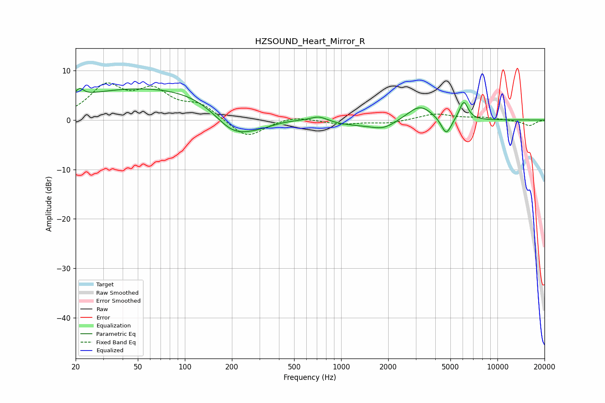

# HZSOUND_Heart_Mirror_R
See [usage instructions](https://github.com/jaakkopasanen/AutoEq#usage) for more options and info.

### Parametric EQs
Apply preamp of -6.5 dB when using parametric equalizer.

|   # | Type    |   Fc (Hz) |    Q |   Gain (dB) |
|-----|---------|-----------|------|-------------|
|   1 | Peaking |        21 | 5.69 |         1.6 |
|   2 | Peaking |        81 | 0.18 |         7   |
|   3 | Peaking |       200 | 1.11 |        -5.3 |
|   4 | Peaking |       290 | 0.9  |        -3.5 |
|   5 | Peaking |       724 | 2.55 |         1.2 |
|   6 | Peaking |      1132 | 0.41 |        -1.7 |
|   7 | Peaking |      1857 | 2.01 |        -1.1 |
|   8 | Peaking |      3179 | 1.65 |         3.5 |
|   9 | Peaking |      4705 | 4.27 |        -3.6 |
|  10 | Peaking |      6085 | 4.89 |         3.8 |

### Fixed Band EQs
When using fixed band (also called graphic) equalizer, apply preamp of **-7.6 dB** (if available) and set gains manually with these parameters.

|   # | Type    |   Fc (Hz) |    Q |   Gain (dB) |
|-----|---------|-----------|------|-------------|
|   1 | Peaking |        31 | 1.41 |         6.4 |
|   2 | Peaking |        62 | 1.41 |         5.2 |
|   3 | Peaking |       125 | 1.41 |         2.8 |
|   4 | Peaking |       250 | 1.41 |        -3.8 |
|   5 | Peaking |       500 | 1.41 |         0.9 |
|   6 | Peaking |      1000 | 1.41 |        -0.8 |
|   7 | Peaking |      2000 | 1.41 |        -0.7 |
|   8 | Peaking |      4000 | 1.41 |         1.3 |
|   9 | Peaking |      8000 | 1.41 |         0.5 |
|  10 | Peaking |     16000 | 1.41 |        -1.2 |

### Graphs

