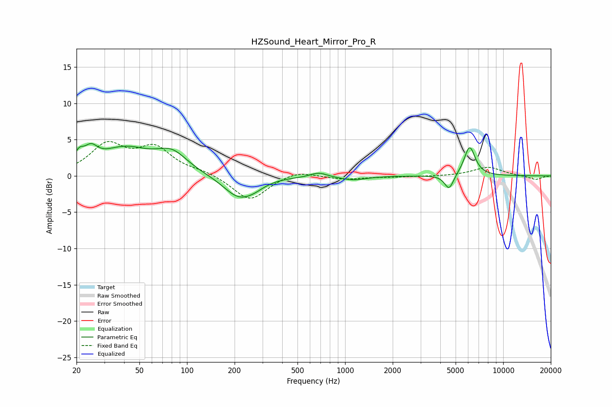

# HZSound_Heart_Mirror_Pro_R
See [usage instructions](https://github.com/jaakkopasanen/AutoEq#usage) for more options and info.

### Parametric EQs
Apply preamp of -4.6 dB when using parametric equalizer.

|   # | Type    |   Fc (Hz) |    Q |   Gain (dB) |
|-----|---------|-----------|------|-------------|
|   1 | Peaking |        21 | 4.89 |         1.6 |
|   2 | Peaking |        25 | 3.4  |         2   |
|   3 | Peaking |        40 | 0.87 |         3.5 |
|   4 | Peaking |        80 | 1.46 |         2.6 |
|   5 | Peaking |       211 | 1.46 |        -2.9 |
|   6 | Peaking |       265 | 2.08 |        -0.7 |
|   7 | Peaking |       680 | 2.82 |         0.6 |
|   8 | Peaking |      1122 | 1.71 |        -0.5 |
|   9 | Peaking |      4548 | 4.9  |        -2.1 |
|  10 | Peaking |      6134 | 3.94 |         4.1 |

### Fixed Band EQs
When using fixed band (also called graphic) equalizer, apply preamp of **-4.8 dB** (if available) and set gains manually with these parameters.

|   # | Type    |   Fc (Hz) |    Q |   Gain (dB) |
|-----|---------|-----------|------|-------------|
|   1 | Peaking |        31 | 1.41 |         4.1 |
|   2 | Peaking |        62 | 1.41 |         3.6 |
|   3 | Peaking |       125 | 1.41 |         0.5 |
|   4 | Peaking |       250 | 1.41 |        -3.5 |
|   5 | Peaking |       500 | 1.41 |         0.8 |
|   6 | Peaking |      1000 | 1.41 |        -0.5 |
|   7 | Peaking |      2000 | 1.41 |        -0.1 |
|   8 | Peaking |      4000 | 1.41 |        -0.1 |
|   9 | Peaking |      8000 | 1.41 |         1.2 |
|  10 | Peaking |     16000 | 1.41 |        -0.5 |

### Graphs

