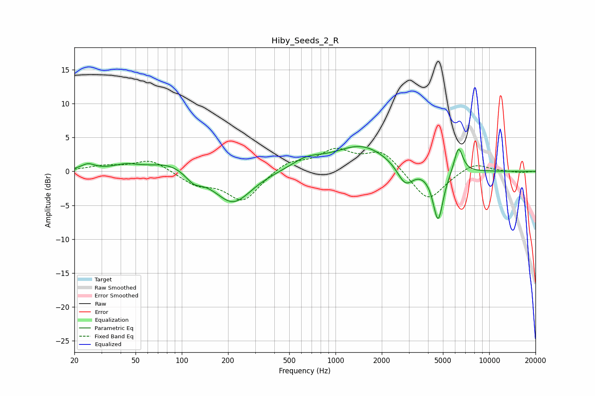

# Hiby_Seeds_2_R
See [usage instructions](https://github.com/jaakkopasanen/AutoEq#usage) for more options and info.

### Parametric EQs
Apply preamp of -3.8 dB when using parametric equalizer.

|   # | Type    |   Fc (Hz) |    Q |   Gain (dB) |
|-----|---------|-----------|------|-------------|
|   1 | Peaking |        24 | 3.2  |         0.9 |
|   2 | Peaking |        43 | 1.68 |         0.8 |
|   3 | Peaking |        84 | 1.07 |         1.5 |
|   4 | Peaking |       119 | 2.66 |        -1.4 |
|   5 | Peaking |       215 | 1.19 |        -4.8 |
|   6 | Peaking |       649 | 1.41 |         1.4 |
|   7 | Peaking |      1480 | 0.78 |         3.8 |
|   8 | Peaking |      2845 | 2.66 |        -3   |
|   9 | Peaking |      4650 | 4.17 |        -7.6 |
|  10 | Peaking |      6312 | 4.83 |         3.9 |

### Fixed Band EQs
When using fixed band (also called graphic) equalizer, apply preamp of **-3.5 dB** (if available) and set gains manually with these parameters.

|   # | Type    |   Fc (Hz) |    Q |   Gain (dB) |
|-----|---------|-----------|------|-------------|
|   1 | Peaking |        31 | 1.41 |         0.7 |
|   2 | Peaking |        62 | 1.41 |         1.8 |
|   3 | Peaking |       125 | 1.41 |        -1.8 |
|   4 | Peaking |       250 | 1.41 |        -4.3 |
|   5 | Peaking |       500 | 1.41 |         1.5 |
|   6 | Peaking |      1000 | 1.41 |         2.9 |
|   7 | Peaking |      2000 | 1.41 |         2.9 |
|   8 | Peaking |      4000 | 1.41 |        -4.5 |
|   9 | Peaking |      8000 | 1.41 |         1.4 |
|  10 | Peaking |     16000 | 1.41 |        -0.2 |

### Graphs

