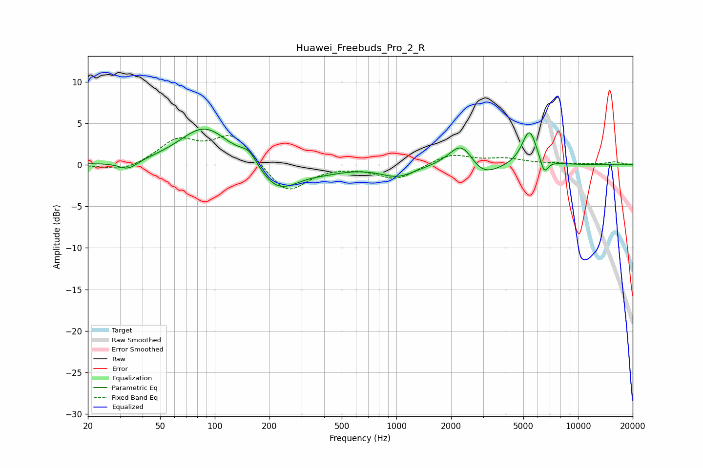

# Huawei_Freebuds_Pro_2_R
See [usage instructions](https://github.com/jaakkopasanen/AutoEq#usage) for more options and info.

### Parametric EQs
Apply preamp of -4.4 dB when using parametric equalizer.

|   # | Type    |   Fc (Hz) |    Q |   Gain (dB) |
|-----|---------|-----------|------|-------------|
|   1 | Peaking |        33 | 2.7  |        -1.1 |
|   2 | Peaking |        88 | 1.01 |         4.7 |
|   3 | Peaking |       154 | 2.89 |         1.7 |
|   4 | Peaking |       221 | 1.21 |        -3.5 |
|   5 | Peaking |       417 | 1.27 |        -0.4 |
|   6 | Peaking |      1016 | 1.48 |        -1.4 |
|   7 | Peaking |      2293 | 2.05 |         3.3 |
|   8 | Peaking |      2930 | 1.59 |        -2   |
|   9 | Peaking |      5399 | 3.41 |         4.3 |
|  10 | Peaking |      6503 | 6    |        -1.9 |

### Fixed Band EQs
When using fixed band (also called graphic) equalizer, apply preamp of **-3.6 dB** (if available) and set gains manually with these parameters.

|   # | Type    |   Fc (Hz) |    Q |   Gain (dB) |
|-----|---------|-----------|------|-------------|
|   1 | Peaking |        31 | 1.41 |        -0.9 |
|   2 | Peaking |        62 | 1.41 |         2.8 |
|   3 | Peaking |       125 | 1.41 |         3.6 |
|   4 | Peaking |       250 | 1.41 |        -3.6 |
|   5 | Peaking |       500 | 1.41 |        -0   |
|   6 | Peaking |      1000 | 1.41 |        -1.8 |
|   7 | Peaking |      2000 | 1.41 |         1.3 |
|   8 | Peaking |      4000 | 1.41 |         0.7 |
|   9 | Peaking |      8000 | 1.41 |         0.1 |
|  10 | Peaking |     16000 | 1.41 |         0.3 |

### Graphs

