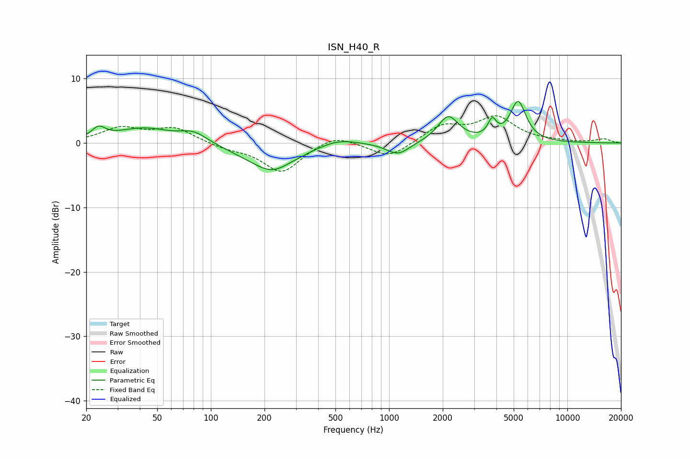

# ISN_H40_R
See [usage instructions](https://github.com/jaakkopasanen/AutoEq#usage) for more options and info.

### Parametric EQs
Apply preamp of -6.5 dB when using parametric equalizer.

|   # | Type    |   Fc (Hz) |    Q |   Gain (dB) |
|-----|---------|-----------|------|-------------|
|   1 | Peaking |        23 | 3.82 |         1.6 |
|   2 | Peaking |        42 | 0.91 |         2.3 |
|   3 | Peaking |        80 | 1.84 |         1.6 |
|   4 | Peaking |       216 | 0.92 |        -3.9 |
|   5 | Peaking |       224 | 2.29 |        -0.5 |
|   6 | Peaking |       514 | 1.29 |         1.1 |
|   7 | Peaking |      1122 | 2.17 |        -1.9 |
|   8 | Peaking |      2147 | 2.41 |         4.1 |
|   9 | Peaking |      3789 | 6    |         2.5 |
|  10 | Peaking |      5293 | 3.12 |         6.2 |

### Fixed Band EQs
When using fixed band (also called graphic) equalizer, apply preamp of **-4.3 dB** (if available) and set gains manually with these parameters.

|   # | Type    |   Fc (Hz) |    Q |   Gain (dB) |
|-----|---------|-----------|------|-------------|
|   1 | Peaking |        31 | 1.41 |         2.2 |
|   2 | Peaking |        62 | 1.41 |         2.2 |
|   3 | Peaking |       125 | 1.41 |        -0.7 |
|   4 | Peaking |       250 | 1.41 |        -4.6 |
|   5 | Peaking |       500 | 1.41 |         1.5 |
|   6 | Peaking |      1000 | 1.41 |        -2.4 |
|   7 | Peaking |      2000 | 1.41 |         2.6 |
|   8 | Peaking |      4000 | 1.41 |         3.8 |
|   9 | Peaking |      8000 | 1.41 |         0.2 |
|  10 | Peaking |     16000 | 1.41 |         0.6 |

### Graphs

