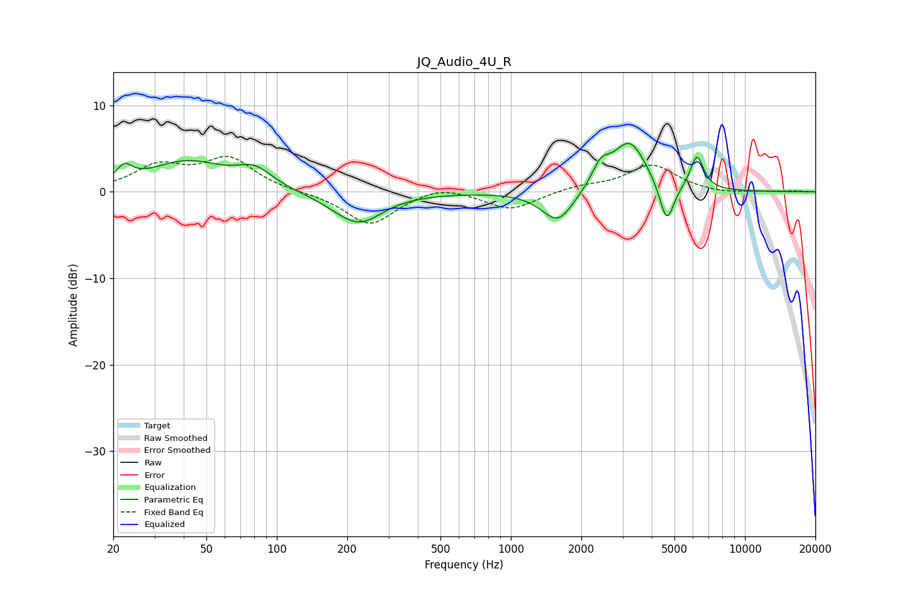

# JQ_Audio_4U_R
See [usage instructions](https://github.com/jaakkopasanen/AutoEq#usage) for more options and info.

### Parametric EQs
Apply preamp of -5.7 dB when using parametric equalizer.

|   # | Type    |   Fc (Hz) |    Q |   Gain (dB) |
|-----|---------|-----------|------|-------------|
|   1 | Peaking |        22 | 4.32 |         1.7 |
|   2 | Peaking |        41 | 0.86 |         3.4 |
|   3 | Peaking |        81 | 1.88 |         2   |
|   4 | Peaking |       217 | 1.28 |        -3.3 |
|   5 | Peaking |       241 | 2.17 |        -0.5 |
|   6 | Peaking |      1588 | 2.07 |        -3.8 |
|   7 | Peaking |      2421 | 3.69 |         2.3 |
|   8 | Peaking |      3214 | 1.92 |         5.8 |
|   9 | Peaking |      4635 | 4.5  |        -4.9 |
|  10 | Peaking |      6236 | 4.84 |         3.9 |

### Fixed Band EQs
When using fixed band (also called graphic) equalizer, apply preamp of **-4.2 dB** (if available) and set gains manually with these parameters.

|   # | Type    |   Fc (Hz) |    Q |   Gain (dB) |
|-----|---------|-----------|------|-------------|
|   1 | Peaking |        31 | 1.41 |         2.8 |
|   2 | Peaking |        62 | 1.41 |         3.7 |
|   3 | Peaking |       125 | 1.41 |        -0   |
|   4 | Peaking |       250 | 1.41 |        -3.9 |
|   5 | Peaking |       500 | 1.41 |         0.9 |
|   6 | Peaking |      1000 | 1.41 |        -2.1 |
|   7 | Peaking |      2000 | 1.41 |         0.6 |
|   8 | Peaking |      4000 | 1.41 |         3.1 |
|   9 | Peaking |      8000 | 1.41 |        -0.3 |
|  10 | Peaking |     16000 | 1.41 |         0.1 |

### Graphs

