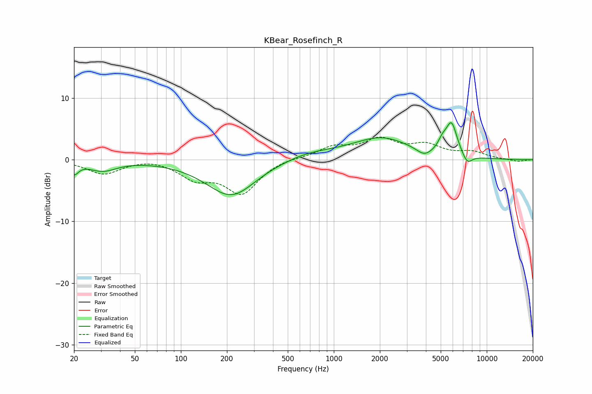

# KBear_Rosefinch_R
See [usage instructions](https://github.com/jaakkopasanen/AutoEq#usage) for more options and info.

### Parametric EQs
Apply preamp of -6.1 dB when using parametric equalizer.

|   # | Type    |   Fc (Hz) |    Q |   Gain (dB) |
|-----|---------|-----------|------|-------------|
|   1 | Peaking |        20 | 4.96 |        -1.8 |
|   2 | Peaking |        31 | 1.57 |        -1.6 |
|   3 | Peaking |       214 | 0.86 |        -6   |
|   4 | Peaking |       485 | 1.48 |        -0.2 |
|   5 | Peaking |       639 | 0.69 |         1.3 |
|   6 | Peaking |      2057 | 0.75 |         3.4 |
|   7 | Peaking |      3903 | 2.91 |        -1.2 |
|   8 | Peaking |      5123 | 4.91 |         1.4 |
|   9 | Peaking |      5879 | 3.64 |         5.3 |
|  10 | Peaking |      7453 | 4.14 |        -1.6 |

### Fixed Band EQs
When using fixed band (also called graphic) equalizer, apply preamp of **-3.8 dB** (if available) and set gains manually with these parameters.

|   # | Type    |   Fc (Hz) |    Q |   Gain (dB) |
|-----|---------|-----------|------|-------------|
|   1 | Peaking |        31 | 1.41 |        -2.3 |
|   2 | Peaking |        62 | 1.41 |         0.4 |
|   3 | Peaking |       125 | 1.41 |        -2.7 |
|   4 | Peaking |       250 | 1.41 |        -5.3 |
|   5 | Peaking |       500 | 1.41 |         0.3 |
|   6 | Peaking |      1000 | 1.41 |         1.9 |
|   7 | Peaking |      2000 | 1.41 |         3   |
|   8 | Peaking |      4000 | 1.41 |         2.1 |
|   9 | Peaking |      8000 | 1.41 |         1.1 |
|  10 | Peaking |     16000 | 1.41 |        -0.3 |

### Graphs

