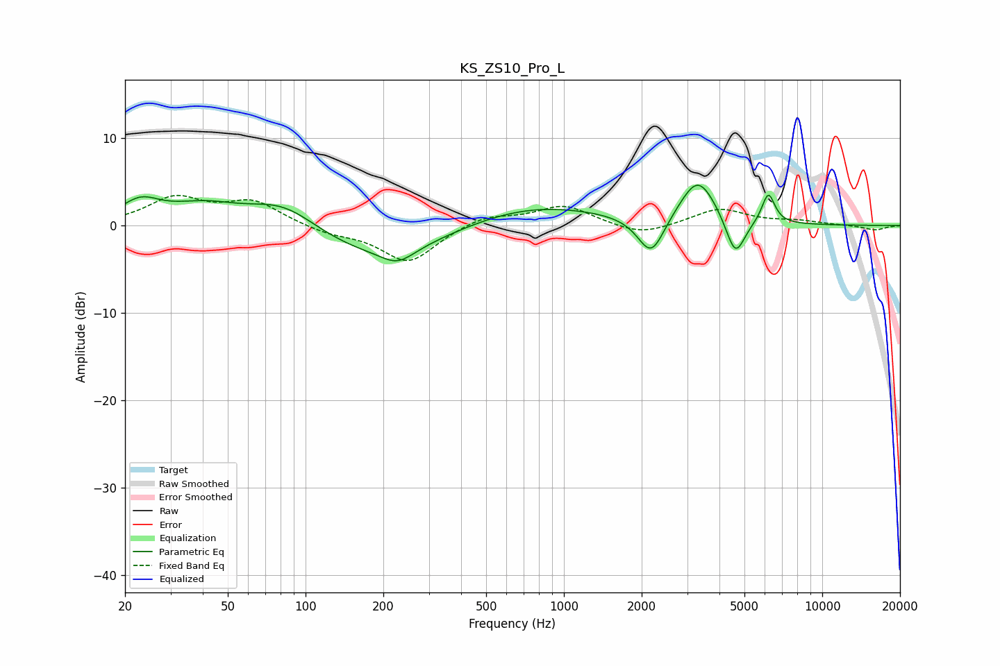

# KS_ZS10_Pro_L
See [usage instructions](https://github.com/jaakkopasanen/AutoEq#usage) for more options and info.

### Parametric EQs
Apply preamp of -4.7 dB when using parametric equalizer.

|   # | Type    |   Fc (Hz) |    Q |   Gain (dB) |
|-----|---------|-----------|------|-------------|
|   1 | Peaking |        23 | 1.89 |         2.4 |
|   2 | Peaking |        40 | 1.02 |         2.2 |
|   3 | Peaking |        83 | 0.96 |         3.8 |
|   4 | Peaking |       183 | 0.44 |        -4.2 |
|   5 | Peaking |       227 | 2.16 |        -1.7 |
|   6 | Peaking |       696 | 0.48 |         2.8 |
|   7 | Peaking |      2177 | 2.72 |        -4.7 |
|   8 | Peaking |      3305 | 1.97 |         5.5 |
|   9 | Peaking |      4610 | 3.72 |        -4.7 |
|  10 | Peaking |      6185 | 5.47 |         3.5 |

### Fixed Band EQs
When using fixed band (also called graphic) equalizer, apply preamp of **-3.5 dB** (if available) and set gains manually with these parameters.

|   # | Type    |   Fc (Hz) |    Q |   Gain (dB) |
|-----|---------|-----------|------|-------------|
|   1 | Peaking |        31 | 1.41 |         3   |
|   2 | Peaking |        62 | 1.41 |         2.6 |
|   3 | Peaking |       125 | 1.41 |        -0.8 |
|   4 | Peaking |       250 | 1.41 |        -4.2 |
|   5 | Peaking |       500 | 1.41 |         1.2 |
|   6 | Peaking |      1000 | 1.41 |         2.3 |
|   7 | Peaking |      2000 | 1.41 |        -1.2 |
|   8 | Peaking |      4000 | 1.41 |         1.9 |
|   9 | Peaking |      8000 | 1.41 |         0.4 |
|  10 | Peaking |     16000 | 1.41 |        -0.5 |

### Graphs

