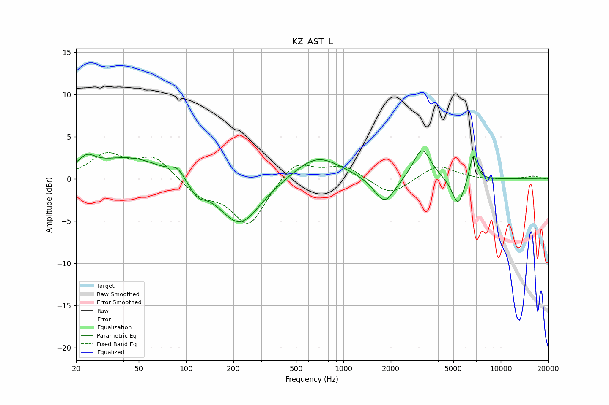

# KZ_AST_L
See [usage instructions](https://github.com/jaakkopasanen/AutoEq#usage) for more options and info.

### Parametric EQs
Apply preamp of -3.4 dB when using parametric equalizer.

|   # | Type    |   Fc (Hz) |    Q |   Gain (dB) |
|-----|---------|-----------|------|-------------|
|   1 | Peaking |        23 | 2.67 |         1.5 |
|   2 | Peaking |        44 | 0.65 |         2.6 |
|   3 | Peaking |        88 | 3.41 |         1.1 |
|   4 | Peaking |       118 | 2.85 |        -1.4 |
|   5 | Peaking |       219 | 1.07 |        -5.6 |
|   6 | Peaking |       681 | 0.95 |         2.9 |
|   7 | Peaking |      1828 | 2.18 |        -3.2 |
|   8 | Peaking |      3161 | 2.56 |         3.8 |
|   9 | Peaking |      5353 | 3.64 |        -3.4 |
|  10 | Peaking |      6700 | 5.77 |         3.3 |

### Fixed Band EQs
When using fixed band (also called graphic) equalizer, apply preamp of **-3.2 dB** (if available) and set gains manually with these parameters.

|   # | Type    |   Fc (Hz) |    Q |   Gain (dB) |
|-----|---------|-----------|------|-------------|
|   1 | Peaking |        31 | 1.41 |         2.7 |
|   2 | Peaking |        62 | 1.41 |         2.5 |
|   3 | Peaking |       125 | 1.41 |        -1.9 |
|   4 | Peaking |       250 | 1.41 |        -5.5 |
|   5 | Peaking |       500 | 1.41 |         2.3 |
|   6 | Peaking |      1000 | 1.41 |         1.6 |
|   7 | Peaking |      2000 | 1.41 |        -2   |
|   8 | Peaking |      4000 | 1.41 |         1.7 |
|   9 | Peaking |      8000 | 1.41 |        -0.1 |
|  10 | Peaking |     16000 | 1.41 |         0.3 |

### Graphs

