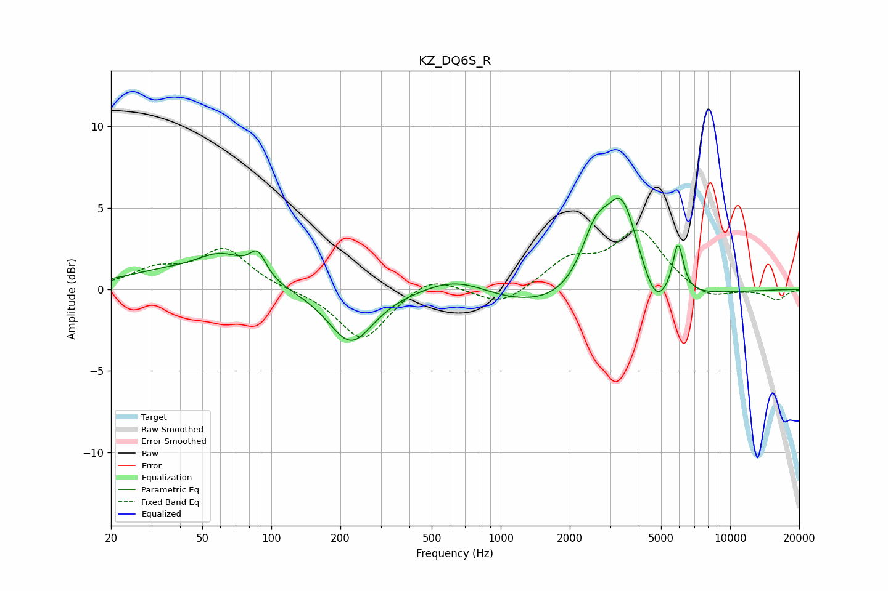

# KZ_DQ6S_R
See [usage instructions](https://github.com/jaakkopasanen/AutoEq#usage) for more options and info.

### Parametric EQs
Apply preamp of -5.7 dB when using parametric equalizer.

|   # | Type    |   Fc (Hz) |    Q |   Gain (dB) |
|-----|---------|-----------|------|-------------|
|   1 | Peaking |        33 | 0.75 |         0.8 |
|   2 | Peaking |        61 | 1.25 |         1.8 |
|   3 | Peaking |        87 | 3.94 |         1.5 |
|   4 | Peaking |       222 | 1.45 |        -3.3 |
|   5 | Peaking |       645 | 0.92 |         1.3 |
|   6 | Peaking |      1933 | 0.32 |        -1.6 |
|   7 | Peaking |      2592 | 2.13 |         3.5 |
|   8 | Peaking |      3393 | 2    |         5.6 |
|   9 | Peaking |      4721 | 2.75 |        -1.6 |
|  10 | Peaking |      5927 | 6    |         3.1 |

### Fixed Band EQs
When using fixed band (also called graphic) equalizer, apply preamp of **-3.7 dB** (if available) and set gains manually with these parameters.

|   # | Type    |   Fc (Hz) |    Q |   Gain (dB) |
|-----|---------|-----------|------|-------------|
|   1 | Peaking |        31 | 1.41 |         1.1 |
|   2 | Peaking |        62 | 1.41 |         2.4 |
|   3 | Peaking |       125 | 1.41 |        -0   |
|   4 | Peaking |       250 | 1.41 |        -3.2 |
|   5 | Peaking |       500 | 1.41 |         1   |
|   6 | Peaking |      1000 | 1.41 |        -1.1 |
|   7 | Peaking |      2000 | 1.41 |         1.7 |
|   8 | Peaking |      4000 | 1.41 |         3.5 |
|   9 | Peaking |      8000 | 1.41 |        -0.7 |
|  10 | Peaking |     16000 | 1.41 |        -0.6 |

### Graphs

