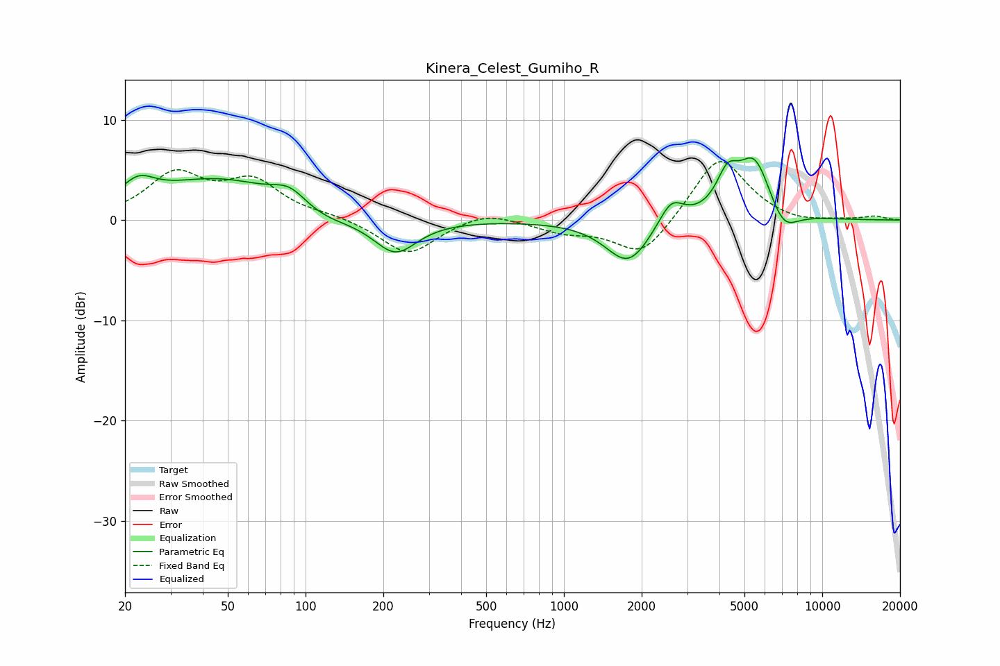

# Kinera_Celest_Gumiho_R
See [usage instructions](https://github.com/jaakkopasanen/AutoEq#usage) for more options and info.

### Parametric EQs
Apply preamp of -6.3 dB when using parametric equalizer.

|   # | Type    |   Fc (Hz) |    Q |   Gain (dB) |
|-----|---------|-----------|------|-------------|
|   1 | Peaking |        22 | 2.19 |         2.1 |
|   2 | Peaking |        46 | 0.56 |         4   |
|   3 | Peaking |        87 | 2.14 |         1.7 |
|   4 | Peaking |       116 | 1.26 |        -1   |
|   5 | Peaking |       222 | 1.67 |        -3.5 |
|   6 | Peaking |      1775 | 1.63 |        -4.4 |
|   7 | Peaking |      2600 | 2.88 |         2.6 |
|   8 | Peaking |      4292 | 3.32 |         3.3 |
|   9 | Peaking |      5470 | 2.08 |         6.1 |
|  10 | Peaking |      7054 | 2.43 |        -2.5 |

### Fixed Band EQs
When using fixed band (also called graphic) equalizer, apply preamp of **-5.9 dB** (if available) and set gains manually with these parameters.

|   # | Type    |   Fc (Hz) |    Q |   Gain (dB) |
|-----|---------|-----------|------|-------------|
|   1 | Peaking |        31 | 1.41 |         4.3 |
|   2 | Peaking |        62 | 1.41 |         3.6 |
|   3 | Peaking |       125 | 1.41 |         0.4 |
|   4 | Peaking |       250 | 1.41 |        -3.5 |
|   5 | Peaking |       500 | 1.41 |         1   |
|   6 | Peaking |      1000 | 1.41 |        -1.1 |
|   7 | Peaking |      2000 | 1.41 |        -3.8 |
|   8 | Peaking |      4000 | 1.41 |         6.6 |
|   9 | Peaking |      8000 | 1.41 |        -0.4 |
|  10 | Peaking |     16000 | 1.41 |         0.4 |

### Graphs

