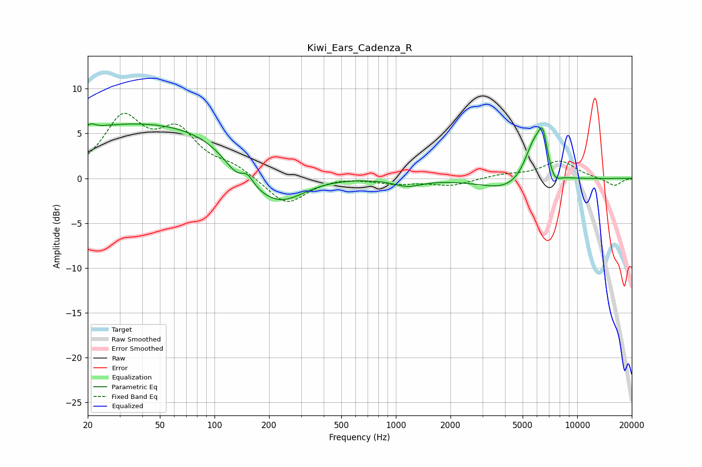

# Kiwi_Ears_Cadenza_R
See [usage instructions](https://github.com/jaakkopasanen/AutoEq#usage) for more options and info.

### Parametric EQs
Apply preamp of -6.2 dB when using parametric equalizer.

|   # | Type    |   Fc (Hz) |    Q |   Gain (dB) |
|-----|---------|-----------|------|-------------|
|   1 | Peaking |        21 | 6    |         0.5 |
|   2 | Peaking |        46 | 0.2  |         6.4 |
|   3 | Peaking |       144 | 1.73 |        -3.3 |
|   4 | Peaking |       151 | 3.42 |         2.3 |
|   5 | Peaking |       224 | 0.9  |        -5   |
|   6 | Peaking |      1162 | 1.8  |        -0.8 |
|   7 | Peaking |      4500 | 0.93 |        -1.8 |
|   8 | Peaking |      5814 | 2.33 |         5   |
|   9 | Peaking |      6465 | 5.58 |         3.3 |
|  10 | Peaking |      7491 | 4.11 |        -1.3 |

### Fixed Band EQs
When using fixed band (also called graphic) equalizer, apply preamp of **-7.3 dB** (if available) and set gains manually with these parameters.

|   # | Type    |   Fc (Hz) |    Q |   Gain (dB) |
|-----|---------|-----------|------|-------------|
|   1 | Peaking |        31 | 1.41 |         6.3 |
|   2 | Peaking |        62 | 1.41 |         4.7 |
|   3 | Peaking |       125 | 1.41 |         1.2 |
|   4 | Peaking |       250 | 1.41 |        -3   |
|   5 | Peaking |       500 | 1.41 |         0.2 |
|   6 | Peaking |      1000 | 1.41 |        -0.5 |
|   7 | Peaking |      2000 | 1.41 |        -0.8 |
|   8 | Peaking |      4000 | 1.41 |         0.4 |
|   9 | Peaking |      8000 | 1.41 |         1.9 |
|  10 | Peaking |     16000 | 1.41 |        -0.9 |

### Graphs

