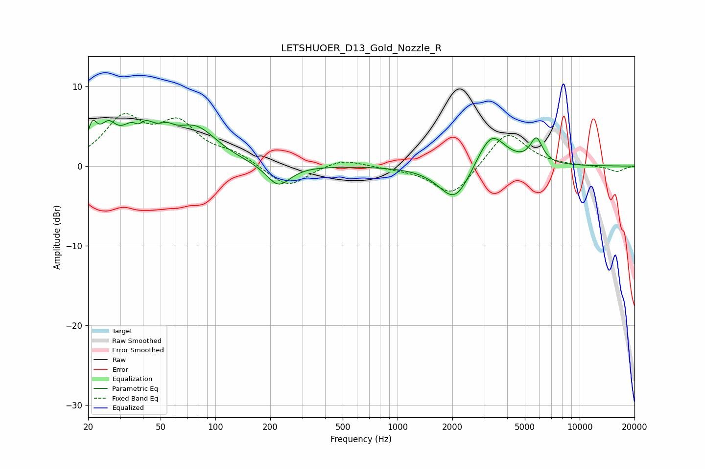

# LETSHUOER_D13_Gold_Nozzle_R
See [usage instructions](https://github.com/jaakkopasanen/AutoEq#usage) for more options and info.

### Parametric EQs
Apply preamp of -5.8 dB when using parametric equalizer.

|   # | Type    |   Fc (Hz) |    Q |   Gain (dB) |
|-----|---------|-----------|------|-------------|
|   1 | Peaking |        21 | 5.21 |         3.4 |
|   2 | Peaking |        26 | 3.22 |         3.1 |
|   3 | Peaking |        38 | 4.91 |        -1.8 |
|   4 | Peaking |        38 | 1.92 |         5.4 |
|   5 | Peaking |        54 | 3.42 |         1.1 |
|   6 | Peaking |        78 | 1.15 |         4.4 |
|   7 | Peaking |       222 | 2.16 |        -2.8 |
|   8 | Peaking |      2066 | 1.62 |        -4.7 |
|   9 | Peaking |      3265 | 1.78 |         4.7 |
|  10 | Peaking |      5785 | 4.12 |         3.1 |

### Fixed Band EQs
When using fixed band (also called graphic) equalizer, apply preamp of **-6.7 dB** (if available) and set gains manually with these parameters.

|   # | Type    |   Fc (Hz) |    Q |   Gain (dB) |
|-----|---------|-----------|------|-------------|
|   1 | Peaking |        31 | 1.41 |         5.6 |
|   2 | Peaking |        62 | 1.41 |         4.8 |
|   3 | Peaking |       125 | 1.41 |         1.3 |
|   4 | Peaking |       250 | 1.41 |        -2.8 |
|   5 | Peaking |       500 | 1.41 |         1   |
|   6 | Peaking |      1000 | 1.41 |        -0.2 |
|   7 | Peaking |      2000 | 1.41 |        -3.9 |
|   8 | Peaking |      4000 | 1.41 |         4.5 |
|   9 | Peaking |      8000 | 1.41 |         0   |
|  10 | Peaking |     16000 | 1.41 |        -0.7 |

### Graphs

