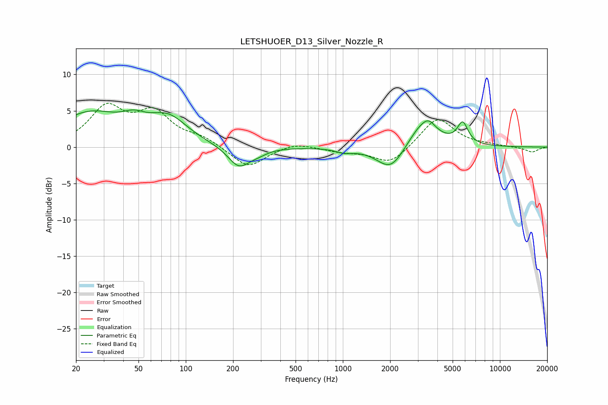

# LETSHUOER_D13_Silver_Nozzle_R
See [usage instructions](https://github.com/jaakkopasanen/AutoEq#usage) for more options and info.

### Parametric EQs
Apply preamp of -5.2 dB when using parametric equalizer.

|   # | Type    |   Fc (Hz) |    Q |   Gain (dB) |
|-----|---------|-----------|------|-------------|
|   1 | Peaking |        24 | 0.69 |         4.5 |
|   2 | Peaking |        47 | 1.91 |         1.4 |
|   3 | Peaking |        77 | 1.15 |         3.5 |
|   4 | Peaking |       218 | 2.01 |        -2.9 |
|   5 | Peaking |       289 | 2.42 |        -0.5 |
|   6 | Peaking |      1025 | 2.65 |        -0.5 |
|   7 | Peaking |      2023 | 1.6  |        -3.5 |
|   8 | Peaking |      3224 | 1.49 |         3.6 |
|   9 | Peaking |      3533 | 3.88 |         0.9 |
|  10 | Peaking |      5795 | 4.12 |         2.9 |

### Fixed Band EQs
When using fixed band (also called graphic) equalizer, apply preamp of **-6.1 dB** (if available) and set gains manually with these parameters.

|   # | Type    |   Fc (Hz) |    Q |   Gain (dB) |
|-----|---------|-----------|------|-------------|
|   1 | Peaking |        31 | 1.41 |         5.2 |
|   2 | Peaking |        62 | 1.41 |         4.3 |
|   3 | Peaking |       125 | 1.41 |         1.1 |
|   4 | Peaking |       250 | 1.41 |        -2.9 |
|   5 | Peaking |       500 | 1.41 |         0.7 |
|   6 | Peaking |      1000 | 1.41 |        -0.6 |
|   7 | Peaking |      2000 | 1.41 |        -2.4 |
|   8 | Peaking |      4000 | 1.41 |         4.1 |
|   9 | Peaking |      8000 | 1.41 |         0.2 |
|  10 | Peaking |     16000 | 1.41 |        -0.7 |

### Graphs

