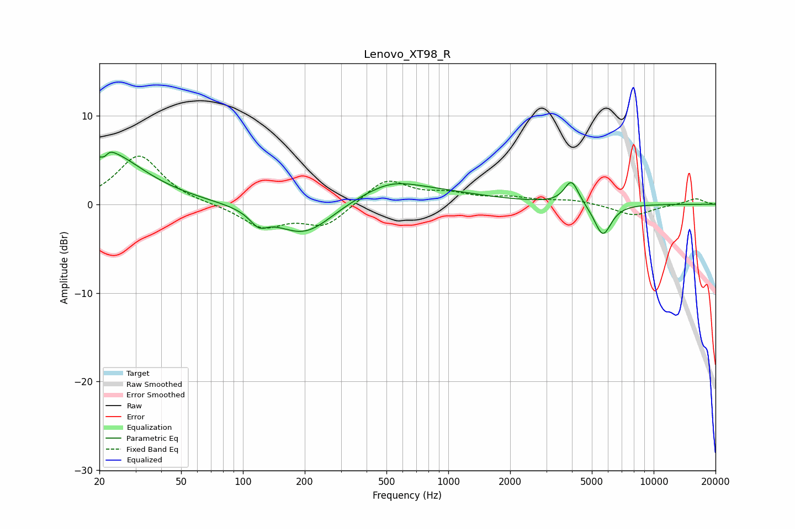

# Lenovo_XT98_R
See [usage instructions](https://github.com/jaakkopasanen/AutoEq#usage) for more options and info.

### Parametric EQs
Apply preamp of -6.0 dB when using parametric equalizer.

|   # | Type    |   Fc (Hz) |    Q |   Gain (dB) |
|-----|---------|-----------|------|-------------|
|   1 | Peaking |        21 | 5.99 |        -2.6 |
|   2 | Peaking |        22 | 5.5  |         2.4 |
|   3 | Peaking |        22 | 0.69 |         4.2 |
|   4 | Peaking |        23 | 1.27 |         1.5 |
|   5 | Peaking |       119 | 3.36 |        -1.5 |
|   6 | Peaking |       200 | 0.96 |        -4.1 |
|   7 | Peaking |       527 | 1.29 |         0.9 |
|   8 | Peaking |       552 | 0.43 |         2.1 |
|   9 | Peaking |      3980 | 4.04 |         2.7 |
|  10 | Peaking |      5654 | 3.37 |        -3.6 |

### Fixed Band EQs
When using fixed band (also called graphic) equalizer, apply preamp of **-5.5 dB** (if available) and set gains manually with these parameters.

|   # | Type    |   Fc (Hz) |    Q |   Gain (dB) |
|-----|---------|-----------|------|-------------|
|   1 | Peaking |        31 | 1.41 |         5.5 |
|   2 | Peaking |        62 | 1.41 |        -0   |
|   3 | Peaking |       125 | 1.41 |        -2.5 |
|   4 | Peaking |       250 | 1.41 |        -2.5 |
|   5 | Peaking |       500 | 1.41 |         2.9 |
|   6 | Peaking |      1000 | 1.41 |         1   |
|   7 | Peaking |      2000 | 1.41 |         0.6 |
|   8 | Peaking |      4000 | 1.41 |         0.5 |
|   9 | Peaking |      8000 | 1.41 |        -1.3 |
|  10 | Peaking |     16000 | 1.41 |         0.7 |

### Graphs

