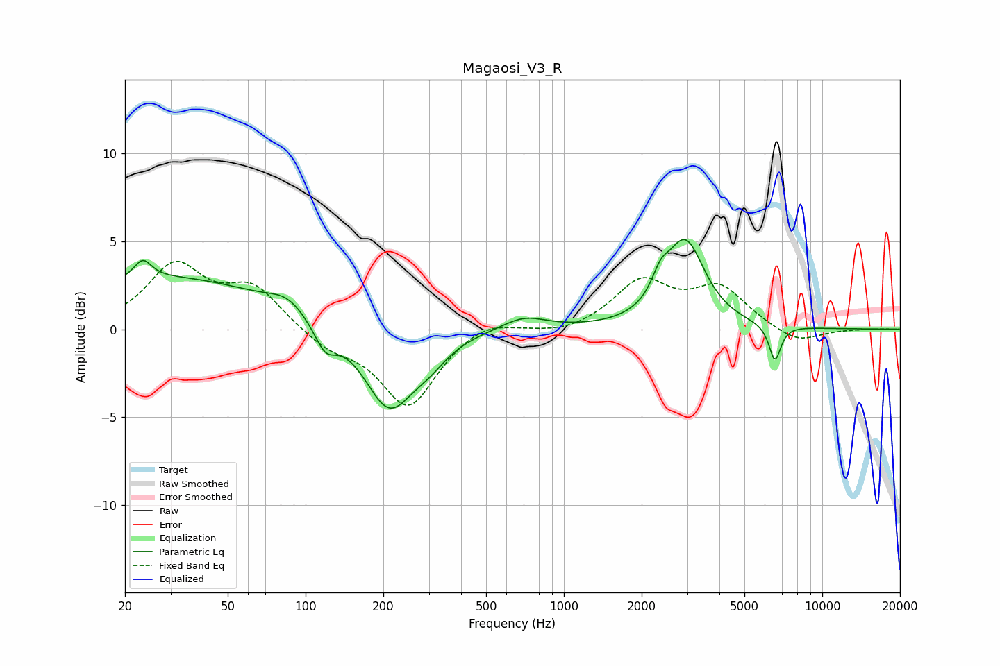

# Magaosi_V3_R
See [usage instructions](https://github.com/jaakkopasanen/AutoEq#usage) for more options and info.

### Parametric EQs
Apply preamp of -5.2 dB when using parametric equalizer.

|   # | Type    |   Fc (Hz) |    Q |   Gain (dB) |
|-----|---------|-----------|------|-------------|
|   1 | Peaking |        23 | 4.27 |         1.1 |
|   2 | Peaking |        29 | 0.34 |         2.9 |
|   3 | Peaking |        85 | 2.02 |         0.8 |
|   4 | Peaking |       119 | 3.32 |        -1.5 |
|   5 | Peaking |       210 | 1.47 |        -4.6 |
|   6 | Peaking |       303 | 2.01 |        -0.9 |
|   7 | Peaking |       700 | 1.63 |         0.8 |
|   8 | Peaking |      2364 | 4.27 |         1.2 |
|   9 | Peaking |      2951 | 1.9  |         4.9 |
|  10 | Peaking |      6561 | 6    |        -2.1 |

### Fixed Band EQs
When using fixed band (also called graphic) equalizer, apply preamp of **-4.0 dB** (if available) and set gains manually with these parameters.

|   # | Type    |   Fc (Hz) |    Q |   Gain (dB) |
|-----|---------|-----------|------|-------------|
|   1 | Peaking |        31 | 1.41 |         3.5 |
|   2 | Peaking |        62 | 1.41 |         2.3 |
|   3 | Peaking |       125 | 1.41 |        -1   |
|   4 | Peaking |       250 | 1.41 |        -4.4 |
|   5 | Peaking |       500 | 1.41 |         0.7 |
|   6 | Peaking |      1000 | 1.41 |        -0.3 |
|   7 | Peaking |      2000 | 1.41 |         2.6 |
|   8 | Peaking |      4000 | 1.41 |         2.2 |
|   9 | Peaking |      8000 | 1.41 |        -0.9 |
|  10 | Peaking |     16000 | 1.41 |         0   |

### Graphs

