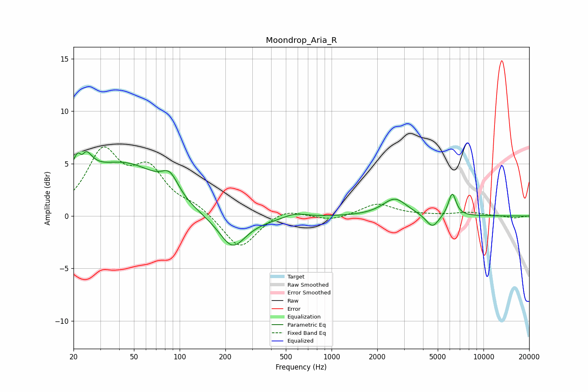

# Moondrop_Aria_R
See [usage instructions](https://github.com/jaakkopasanen/AutoEq#usage) for more options and info.

### Parametric EQs
Apply preamp of -6.2 dB when using parametric equalizer.

|   # | Type    |   Fc (Hz) |    Q |   Gain (dB) |
|-----|---------|-----------|------|-------------|
|   1 | Peaking |        22 | 3.21 |         5.3 |
|   2 | Peaking |        23 | 5.95 |        -2.7 |
|   3 | Peaking |        45 | 0.51 |         5.3 |
|   4 | Peaking |        86 | 2.6  |         1.8 |
|   5 | Peaking |       139 | 0.42 |        -1.1 |
|   6 | Peaking |       223 | 1.71 |        -2.7 |
|   7 | Peaking |       575 | 1.87 |         0.5 |
|   8 | Peaking |      2607 | 1.78 |         1.7 |
|   9 | Peaking |      4611 | 3.3  |        -1.3 |
|  10 | Peaking |      6227 | 5.41 |         2.2 |

### Fixed Band EQs
When using fixed band (also called graphic) equalizer, apply preamp of **-6.7 dB** (if available) and set gains manually with these parameters.

|   # | Type    |   Fc (Hz) |    Q |   Gain (dB) |
|-----|---------|-----------|------|-------------|
|   1 | Peaking |        31 | 1.41 |         5.8 |
|   2 | Peaking |        62 | 1.41 |         3.9 |
|   3 | Peaking |       125 | 1.41 |         0.8 |
|   4 | Peaking |       250 | 1.41 |        -3.2 |
|   5 | Peaking |       500 | 1.41 |         0.8 |
|   6 | Peaking |      1000 | 1.41 |        -0.5 |
|   7 | Peaking |      2000 | 1.41 |         1.2 |
|   8 | Peaking |      4000 | 1.41 |         0.1 |
|   9 | Peaking |      8000 | 1.41 |         0.3 |
|  10 | Peaking |     16000 | 1.41 |        -0.2 |

### Graphs

