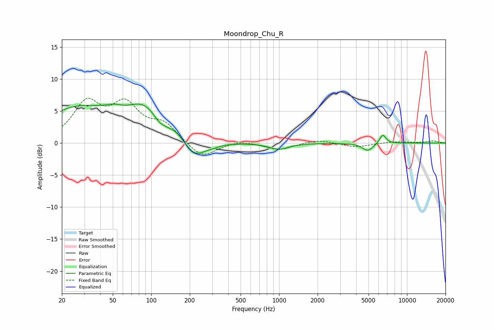

# Moondrop_Chu_R
See [usage instructions](https://github.com/jaakkopasanen/AutoEq#usage) for more options and info.

### Parametric EQs
Apply preamp of -6.2 dB when using parametric equalizer.

|   # | Type    |   Fc (Hz) |    Q |   Gain (dB) |
|-----|---------|-----------|------|-------------|
|   1 | Peaking |        27 | 0.52 |         5.3 |
|   2 | Peaking |        51 | 1.97 |         0.9 |
|   3 | Peaking |        88 | 1.09 |         4.4 |
|   4 | Peaking |       116 | 3.44 |        -0.8 |
|   5 | Peaking |       157 | 3.11 |         0.6 |
|   6 | Peaking |       220 | 1.82 |        -2.5 |
|   7 | Peaking |       300 | 2.31 |        -0.4 |
|   8 | Peaking |       995 | 1.92 |        -1   |
|   9 | Peaking |      4940 | 3.33 |        -1.2 |
|  10 | Peaking |      6465 | 5.63 |         1.4 |

### Fixed Band EQs
When using fixed band (also called graphic) equalizer, apply preamp of **-7.1 dB** (if available) and set gains manually with these parameters.

|   # | Type    |   Fc (Hz) |    Q |   Gain (dB) |
|-----|---------|-----------|------|-------------|
|   1 | Peaking |        31 | 1.41 |         5.9 |
|   2 | Peaking |        62 | 1.41 |         5.4 |
|   3 | Peaking |       125 | 1.41 |         2.7 |
|   4 | Peaking |       250 | 1.41 |        -2.5 |
|   5 | Peaking |       500 | 1.41 |         0.5 |
|   6 | Peaking |      1000 | 1.41 |        -1.1 |
|   7 | Peaking |      2000 | 1.41 |         0.6 |
|   8 | Peaking |      4000 | 1.41 |        -0.6 |
|   9 | Peaking |      8000 | 1.41 |         0.2 |
|  10 | Peaking |     16000 | 1.41 |         0.3 |

### Graphs

