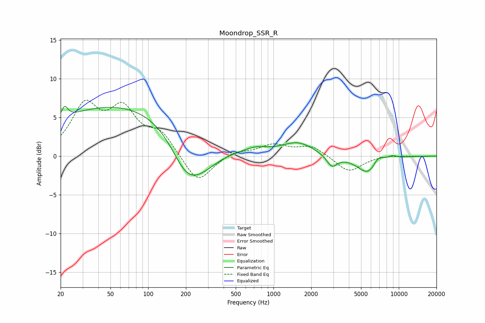

# Moondrop_SSR_R
See [usage instructions](https://github.com/jaakkopasanen/AutoEq#usage) for more options and info.

### Parametric EQs
Apply preamp of -6.5 dB when using parametric equalizer.

|   # | Type    |   Fc (Hz) |    Q |   Gain (dB) |
|-----|---------|-----------|------|-------------|
|   1 | Peaking |        22 | 5.68 |         1.5 |
|   2 | Peaking |        71 | 0.2  |         6.9 |
|   3 | Peaking |       197 | 1.23 |        -3.3 |
|   4 | Peaking |       250 | 0.81 |        -4.7 |
|   5 | Peaking |       724 | 1.76 |         0.6 |
|   6 | Peaking |      1568 | 1.11 |         1.7 |
|   7 | Peaking |      2928 | 3.38 |        -1.5 |
|   8 | Peaking |      5813 | 1.52 |        -2.7 |
|   9 | Peaking |      6839 | 2.75 |         1.5 |
|  10 | Peaking |      8869 | 3.55 |         0.4 |

### Fixed Band EQs
When using fixed band (also called graphic) equalizer, apply preamp of **-7.3 dB** (if available) and set gains manually with these parameters.

|   # | Type    |   Fc (Hz) |    Q |   Gain (dB) |
|-----|---------|-----------|------|-------------|
|   1 | Peaking |        31 | 1.41 |         6.1 |
|   2 | Peaking |        62 | 1.41 |         5.4 |
|   3 | Peaking |       125 | 1.41 |         2.7 |
|   4 | Peaking |       250 | 1.41 |        -3.7 |
|   5 | Peaking |       500 | 1.41 |         0.7 |
|   6 | Peaking |      1000 | 1.41 |         1.4 |
|   7 | Peaking |      2000 | 1.41 |         1.3 |
|   8 | Peaking |      4000 | 1.41 |        -2.1 |
|   9 | Peaking |      8000 | 1.41 |         0.1 |
|  10 | Peaking |     16000 | 1.41 |        -0   |

### Graphs

